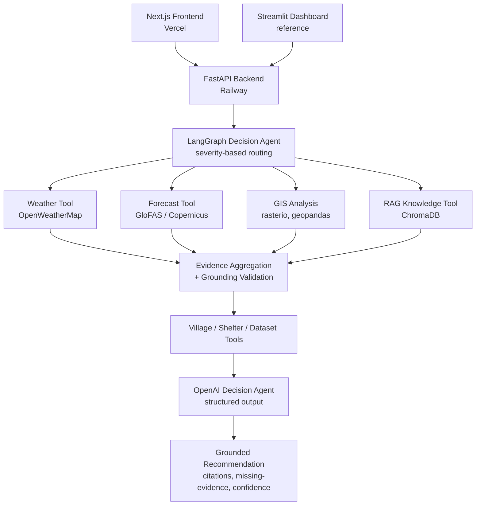

# Flood-Aware

> **A grounded, evidence-based flood decision-support system for the Swat River Basin, Khyber Pakhtunkhwa**

**BS Computer Science — Final Year Project**
Department of Computer Science, University of Peshawar
Session 2022–2026

[](https://flood-aware.vercel.app)
[](https://flood-aware-production.up.railway.app/health)
[](LICENSE)

**Live:** [flood-aware.vercel.app](https://flood-aware.vercel.app)

---

## Overview

Flood-Aware is an AI decision-support system built for real disaster-management use, not a generic chatbot wrapper. Every recommendation it produces is grounded in real evidence — live weather data, GloFAS hydrological forecasts, GIS-derived population and infrastructure exposure, real village and shelter records, and official government disaster-management documentation (PDMA/NDMP) — and the system is explicitly designed to **never fabricate what it doesn't know**.

When evidence is missing or outdated, Flood-Aware says so, in plain language, rather than guessing. This honesty guarantee — enforced at the parser level, not just prompted for — is the core engineering contribution of this project, refined over dozens of real, live-tested iterations documented in full in [`docs/CHANGELOG.md`](docs/CHANGELOG.md).

The system is built around a real, working **LangGraph** multi-tool decision agent, a **FastAPI** backend, and two independent frontends: a production **Next.js** web application and a **Streamlit** dashboard, retained as a reference implementation.

---

## Live System

| | |
|---|---|
| **Frontend** | [flood-aware.vercel.app](https://flood-aware.vercel.app) |
| **Backend API** | [flood-aware-production.up.railway.app](https://flood-aware-production.up.railway.app) |
| **Health check** | [/health](https://flood-aware-production.up.railway.app/health) |

**Pages:**
- **Flood-Aware Agent** — grounded, multi-turn flood-risk conversation for any village in the coverage area
- **Policy Advisor** — government policy and disaster-management guidance, grounded in real PDMA/NDMP documents
- **Situation Room** — live village/shelter data, dataset provenance, and an interactive map

---

## Why This Is Different From a Generic AI Chatbot

Most LLM-backed tools will confidently answer any question, whether or not they actually have the information to back it up. For a disaster-response tool, that's a genuine safety risk — a system that invents shelter capacity or fabricates flood-zone specifics is worse than one that admits it doesn't know.

Flood-Aware enforces its honesty guarantee at multiple layers, not just in the prompt:

- **Grounding validation** — every citation is checked against the real evidence bundle; hallucinated citations are rejected and the model is given a targeted, structured correction and asked to retry
- **Specificity enforcement** — a response citing real evidence must actually use the real figures, not vague generalities — while a response correctly, honestly declining to speculate on absent evidence is never penalized for lacking numbers it was never given
- **Action-grounding checks** — a recommended action can never be built entirely around a category of evidence that's genuinely absent (e.g. recommending specific shelter capacity when no shelter data exists), while still allowing honest, general guidance ("obtain shelter data before finalizing plans")
- **Staleness awareness** — forecast data past its useful age is flagged to the user, not silently treated as current

Every one of these mechanisms was found, built, and refined through real, adversarial, live testing — not designed in the abstract. The full record of that process, including several genuinely difficult bugs traced to their true root cause rather than patched around, is documented in the project changelog.

---

## System Architecture



---

## Features

### Grounded Multi-Tool Reasoning
- LangGraph-orchestrated decision agent with severity-based conditional tool routing
- Seven real evidence sources, only invoked when relevant to the assessed flood severity
- Structured, schema-validated LLM output — never free-text guessing

### Real GIS Analysis
- Population and infrastructure exposure via WorldPop and OpenStreetMap
- Flood-zone buffering from real river network geometry
- Regionally-extracted datasets for fast, deployment-viable startup (~2 seconds on production hardware)

### Real Hydrological Forecasting
- GloFAS discharge forecasts via Copernicus's Climate Data Store
- Automatic staleness detection and honest disclosure when forecast data is outdated

### Grounded Government Knowledge (RAG)
- Retrieval over real PDMA/NDMP disaster-management documents
- Relevance-thresholded retrieval — weak or irrelevant matches are rejected rather than cited
- Every claim traceable to a real, cited source document and page

### Multi-Turn Conversation
- Real conversation memory with evidence reuse across turns
- Follow-up questions correctly shift focus to what's actually being asked, rather than repeating a generic overview

### Two Independent Frontends
- **Next.js** (production): real navigation, a deliberate design system, live data, real-time chat
- **Streamlit**: retained as a working reference implementation throughout development

---

## Technology Stack

**Backend**
Python · FastAPI · Pydantic · LangGraph · LangChain

**AI & LLM**
OpenAI API (structured decision agent, embeddings) · ChromaDB (RAG vector store)

**GIS & Spatial Analysis**
GeoPandas · Rasterio · Shapely · PyProj · pyosmium

**Frontend (Production)**
Next.js 16 (App Router) · TypeScript · Tailwind CSS v4 · shadcn/ui · react-leaflet

**Frontend (Reference)**
Streamlit

**Data Sources**
GloFAS (Copernicus Climate Data Store) · WorldPop · OpenStreetMap · PDMA / NDMP official documentation · checked-in village and shelter datasets

**Deployment**
Railway (backend) · Vercel (frontend)

---

## Project Structure

```
Flood-Aware/
│
├── backend/
│   ├── app/
│   │   ├── agents/          # Legacy/alternate agent implementation
│   │   ├── api/             # FastAPI routers
│   │   ├── config/          # Settings, composition root
│   │   ├── conversation/    # Multi-turn session orchestration
│   │   ├── core/            # Exceptions, logging
│   │   ├── data/            # Data access & repositories
│   │   ├── decision/        # LangGraph decision agent, prompt builder, parser
│   │   ├── dtos/            # Data transfer objects
│   │   ├── flood/           # Flood domain classification
│   │   ├── forecast/        # GloFAS integration
│   │   ├── gis/             # GIS analysis pipeline
│   │   ├── graph/           # LangGraph orchestration
│   │   ├── middleware/      # Request middleware
│   │   ├── models/          # Shared domain models & enums
│   │   ├── observability/   # Logging, metrics, health, tracing
│   │   ├── prompts/         # Prompt templates
│   │   ├── rag/             # Government knowledge retrieval
│   │   ├── schemas/         # API request/response contracts
│   │   ├── services/        # Domain services
│   │   ├── tools/           # Agent-callable tools
│   │   ├── use_cases/       # Application use cases
│   │   ├── utils/           # Shared utilities
│   │   ├── weather/         # Weather integration
│   │   ├── composition.py   # DI composition root
│   │   └── main.py          # FastAPI entrypoint
│   │
│   └── tests/               # Backend test suite (unit, integration, golden-set)
│
├── dashboard/                # Streamlit reference dashboard
├── data/                     # Datasets, GIS extracts, knowledge base
├── docs/                     # SRS, TDS, changelog, project board
├── experiments/              # Experimental / research work
├── frontend/                 # Next.js production frontend
├── scripts/                  # Data ingestion, extraction, evaluation
├── tests/                    # Root-level / integration tests
│
├── README.md
├── LICENSE
└── pyproject.toml
```

---

## Documentation

Full project documentation is available in [`docs/`](docs/), including:

- [Software Requirements Specification](docs/SRS.md)
- [Technical Design Specification](docs/TDS.md)
- [API Documentation](docs/API_DOCUMENTATION.md)
- [Data Inventory](docs/DATA_INVENTORY.md)
- [Installation Guide](docs/INSTALLATION.md)
- [Development Plan](docs/DEVELOPMENT_PLAN.md)
- [Complete development changelog](docs/CHANGELOG.md) — a full, honest record of every sprint, every real bug found through live testing, and every fix, with root causes documented rather than glossed over
- [Project board / sprint history](docs/PROJECT_BOARD.md)

---

## Project Status

**Complete and deployed.** All planned core functionality is implemented, tested (unit, integration, and real-API golden-set evaluation), and live on production infrastructure.

| Area | Status |
|---|---|
| Backend (FastAPI, LangGraph agent, GIS, RAG, forecasting) | Complete, deployed |
| Next.js production frontend | Complete, deployed |
| Streamlit reference dashboard | Complete, retained as reference |
| Production deployment (Railway + Vercel) | Live |
| Automated + golden-set testing | Passing |

---

## License

This project is licensed under the MIT License. See [LICENSE](LICENSE) for details.