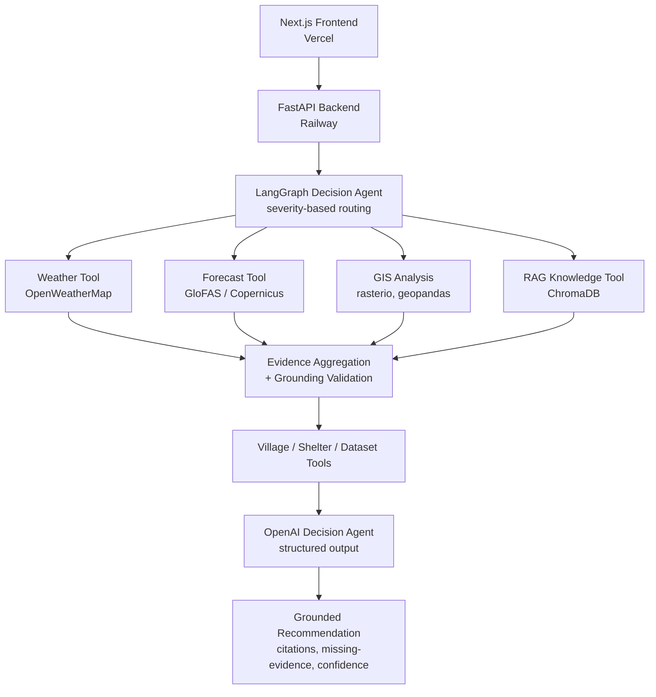
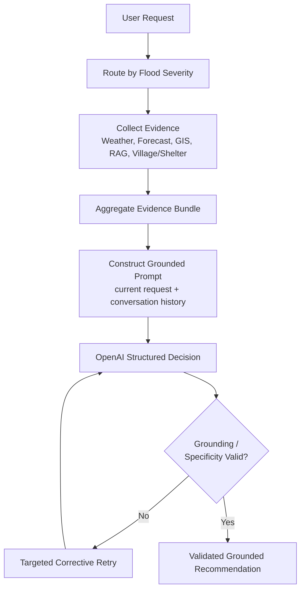

# Technical Design Specification (TDS)

> **Project:** Flood-Aware
> **Version:** 2.0
> **Status:** Complete, deployed to production
> **Document Owner:** Project Lead
> **Last Updated:** August 2026

---

# 1. Purpose

This document serves as the master technical specification for the Flood-Aware system.

It defines the system architecture, major software components, key engineering decisions, and the real, as-built implementation — not a forward-looking plan. For the detailed history of how the system evolved to this state, including specific issues found through live testing and their resolutions, see `docs/CHANGELOG.md`, which is the authoritative development record.

---

# 2. Project Summary

Flood-Aware is a grounded, evidence-based flood decision-support system, live in production for the Swat River Basin, Khyber Pakhtunkhwa.

The platform integrates:

- Real-time weather data
- Hydrological flood forecasting (GloFAS)
- GIS-based population and infrastructure exposure analysis
- Retrieval-Augmented Generation over official government disaster-management documents
- A schema-constrained, structured-output LLM decision agent
- A conversational, multi-turn AI assistant

into a single system whose defining engineering property is that it **never presents a fabricated claim as fact** — a guarantee enforced by parser-level validation, not prompt instruction alone.

---

# 3. Objectives

The system:

- Analyzes flood situations for a specified location using real, current data
- Estimates exposed population and vulnerable infrastructure via real GIS analysis
- Retrieves and cites official disaster-management guidance
- Produces recommendations that are always traceable to real, cited evidence
- Explicitly and honestly discloses when evidence is missing, stale, or insufficient
- Supports natural-language, multi-turn conversation
- Is deployed and publicly accessible, not a local-only prototype

---

# 4. Scope

## Included

- Swat district, Khyber Pakhtunkhwa (defined coverage region)
- Production web application (Next.js) and a retained reference dashboard (Streamlit)
- Grounded AI decision support with enforced non-fabrication guarantees
- Real GIS exposure visualization and analysis
- Real population/infrastructure exposure estimation
- Government-document knowledge retrieval
- Multi-turn conversational interaction
- Live, deployed backend (Railway) and frontend (Vercel)

## Excluded (deliberately, for this version)

- Nationwide deployment beyond the configured coverage region
- Native mobile applications
- IoT sensor integration
- Real-time drone/satellite imagery
- Multi-language support beyond English
- Automated emergency-service dispatch

---

# 5. Functional Requirements

See `docs/SRS.md` for the complete, numbered functional requirements specification. Summary:

- Grounded flood-risk assessment for a specified village
- Multi-turn conversational follow-up with evidence reuse
- Government policy and disaster-management guidance retrieval
- Real village/shelter data browsing and mapping
- Explicit, honest disclosure of evidence gaps and forecast staleness

---

# 6. Non-Functional Requirements

The system provides:

- **Grounding integrity** — the system's core, safety-critical property: no fabricated claim is ever presented as fact, enforced by deterministic, parser-level validation of every citation and action against a real evidence bundle
- **Explainability** — every recommendation includes a plain-language rationale and real, checkable citations
- **Reliability** — the backend fails fast with a clear error at startup if misconfigured, rather than accepting traffic in a broken state; distinct, honest error handling for session expiry, temporary service unavailability, and connectivity failure
- **Maintainability** — layered architecture (API → use cases → services → repositories) with dependency injection, enabling isolated testing
- **Performance** — sub-2-second GIS evidence collection in production (following a deliberate regional-data-extraction optimization); evidence reuse across conversation turns to avoid redundant computation
- **Security** — no secrets in source control; CORS restricted to known, verified frontend origins (including secure pattern-matching for platform-generated preview URLs)
- **Testability** — deterministic unit/integration tests plus a real-API golden-set evaluation suite

---

# 7. High-Level Architecture

---

# 8. Component Overview

## Frontend — Next.js (Production)

Responsibilities: user interface, real-time chat, live data visualization, navigation. Built with TypeScript, Tailwind CSS v4, shadcn/ui, react-leaflet. Four pages: Home, Flood-Aware Agent, Policy Advisor, Situation Room.

## Frontend — Streamlit (Reference)

Retained as a working reference implementation from earlier development. Not the primary production interface.

## Backend API (FastAPI)

Responsibilities: request handling, validation (Pydantic), CORS enforcement, error translation, service orchestration. Endpoints: `/conversation`, `/villages`, `/shelters`, `/datasets/catalog`, `/health`.

## LangGraph Decision Agent

Responsibilities: severity-based conditional tool orchestration, evidence collection, decision workflow state management.

## Forecast Module

Responsibilities: reading pre-ingested local GloFAS snapshots (never live-ingesting within a request path, due to the underlying CDS API's unbounded blocking queue behavior), staleness detection.

## GIS Module

Responsibilities: regional-extract raster/vector processing (rasterio, geopandas, pyosmium), population exposure estimation, flood-zone buffering, infrastructure impact assessment.

## RAG Module

Responsibilities: document chunking and embedding, relevance-thresholded retrieval (weak matches are rejected, not cited), citation generation against real PDMA/NDMP source documents.

## Decision/Grounding Module

Responsibilities: prompt construction, structured-output parsing, and the system's core safety mechanisms — citation-grounding validation, evidence-specificity enforcement, and action-level checks preventing specific claims about entirely-absent evidence categories. Includes a retry-with-feedback loop: a rejected response is returned to the model with a targeted, structured correction rather than a blind retry.

---

# 9. Technology Stack (As Deployed)

**Backend**
Python 3.11 · FastAPI · Uvicorn · Pydantic · uv (dependency management)

**AI & LLM**
LangGraph · LangChain · OpenAI API (structured decision output, embeddings, RAG generation)

**Vector Store**
ChromaDB

**GIS**
GeoPandas · Rasterio · Shapely · PyProj · pyosmium

**Frontend (Production)**
Next.js 16 (App Router) · TypeScript · Tailwind CSS v4 · shadcn/ui · react-leaflet

**Frontend (Reference)**
Streamlit

**Testing**
Pytest (unit/integration) · real-API golden-set evaluation suite

**Deployment**
Railway (backend, native Python runtime, no containerization) · Vercel (frontend)

---

# 10. Data Strategy

## Static / Periodically-Refreshed Data

- Regional OSM extract and WorldPop raster (pre-clipped to the coverage region for deployment-viable performance)
- PDMA/NDMP disaster-management documents (embedded into the Chroma vector store)
- Village and shelter records (checked-in CSV datasets, including real per-record coordinates)

## Dynamic Data

- Live weather conditions (fetched per-request)
- GloFAS forecast snapshots (ingested periodically via a separate offline script, never within a live request)
- LLM-generated decision output (always evidence-grounded, never treated as a data source itself)

Detailed inventory: `docs/DATA_INVENTORY.md`.

---

# 11. AI Decision Workflow

---

# 12. API Overview

| Endpoint | Method | Purpose |
|---|---|---|
| `/health` | GET | Liveness check |
| `/conversation` | POST | Submit a conversation turn, grounded decision response |
| `/villages` | GET | Real village records (name, district, population, coordinates) |
| `/shelters` | GET | Real shelter records (name, district, capacity, coordinates) |
| `/datasets/catalog` | GET | Dataset provenance and record counts |

Full request/response schemas: `docs/API_DOCUMENTATION.md`.

---

# 13. Security

- No secrets in source control; all credentials managed via environment variables on the hosting platform
- CORS restricted via an explicit origin allowlist plus a security-reviewed regex pattern (pinned to the actual hosting account, tested against adversarial spoofing attempts) to correctly and safely support the frontend platform's dynamically-generated deployment URLs
- Input validation via Pydantic schemas at every API boundary
- No leakage of internal exception details or stack traces to API clients

Not yet implemented (identified as future scope for a larger-scale production deployment): user authentication/authorization, request rate limiting.

---

# 14. Performance Strategy

- **GIS regional extraction** — the single highest-impact optimization: reduced GIS evidence-collection time from 2–4 minutes to under 2 seconds in production, by eagerly parsing a pre-clipped regional dataset once at application startup rather than the full national dataset on every request
- **Evidence reuse across conversation turns** — a same-context follow-up reuses previously collected evidence rather than re-fetching it
- **Relevance-thresholded RAG retrieval** — avoids wasted LLM calls on irrelevant retrieved content
- **Severity-based conditional tool routing** — expensive evidence-collection tools (GIS, village/shelter lookup) are only invoked when the assessed severity warrants it

---

# 15. Logging Strategy

Structured logging via Python's standard `logging` module, with a custom formatter surfacing key-value context (node, execution ID, duration, failure type) for observability. Prompt/reasoning content is deliberately excluded from logs as a safe-logging discipline. Log verbosity is environment-configurable (`FLOOD_AWARE_LOG_LEVEL`).

---

# 16. Configuration

Configuration is centralized via `pydantic-settings`-based classes in `backend/app/config/settings.py` and related module-specific settings classes, all environment-variable driven, with sane defaults where appropriate and fail-fast validation for genuinely required values (API keys, required data files).

---

# 17. Testing Strategy

- **Unit and integration tests** (`backend/tests/`) — deterministic, no live external API calls, covering grounding logic, parser validation, routing, and API contract behavior
- **Golden-set evaluation** (`backend/tests/golden/`, gated behind `RUN_GOLDEN_SET=1`) — real, live calls against the actual OpenAI API, verifying reasoning-quality and grounding behavior that cannot be meaningfully mocked
- **Live manual/adversarial testing** — used extensively throughout later development to find and root-cause issues invisible to automated testing (documented in full in `docs/CHANGELOG.md`)

---

# 18. Deployment

**Current, live deployment:**
- Backend: Railway, native Python runtime (Railpack build system), no Docker
- Frontend: Vercel, Next.js native build
- Both on free-tier hosting, no payment information required

See `docs/CHANGELOG.md` (Sprint 16) for the complete deployment process, including real infrastructure decisions and their reasoning (platform selection, system-dependency resolution, CORS configuration for dynamic deployment URLs).

---

# 19. Development History

The system was developed through 16 major sprints, from initial repository setup through production deployment. A complete, sprint-by-sprint account is maintained in `docs/DEVELOPMENT_PLAN.md` (summary) and `docs/CHANGELOG.md` (full detail, including every significant bug found through live testing and its resolution).

---

# 20. Risks and Mitigations

| Risk | Mitigation |
|---|---|
| LLM hallucination / fabricated claims | Parser-level grounding, specificity, and action-grounding validation; retry-with-feedback correction |
| External API unavailability (OpenAI, OpenWeatherMap) | Distinct, honest error handling (503 for temporary unavailability); graceful degradation for non-critical evidence sources |
| Large geospatial dataset processing cost | Regional data extraction, one-time eager startup parsing |
| Forecast data staleness | Explicit staleness detection and disclosure, both internally (confidence reasoning) and to the end user |
| Free-tier hosting resource constraints | Verified within real memory/cold-start budgets during deployment; documented as a known, accepted tradeoff |

---

# 21. Assumptions

- Users have standard web browser access
- The system's coverage scope remains the configured Swat district region
- Real-time internet access is available for live weather/forecast/AI provider calls
- GloFAS forecast snapshots are refreshed periodically via a manual/scheduled offline process, not continuously in real time

---

# 22. References

- `docs/SRS.md` — Software Requirements Specification
- `docs/DEVELOPMENT_PLAN.md` — Development history summary
- `docs/CHANGELOG.md` — Complete, detailed development record
- `docs/CODING_STANDARDS.md`
- `docs/API_DOCUMENTATION.md`
- `docs/DATA_INVENTORY.md`
- `docs/GIS_PROCESSING.md`
- `docs/GOVERNMENT_KNOWLEDGE_BASE.md`
- `docs/WEATHER_TOOL.md`
- `docs/routing-decision-table.md`

---

# 23. Conclusion

This document reflects the real, as-built architecture of Flood-Aware as a complete, deployed system. It supersedes earlier planning-stage versions of this specification. Future architectural changes should update this document alongside implementation, consistent with the project's established practice of keeping documentation accurate to the current state of the system.