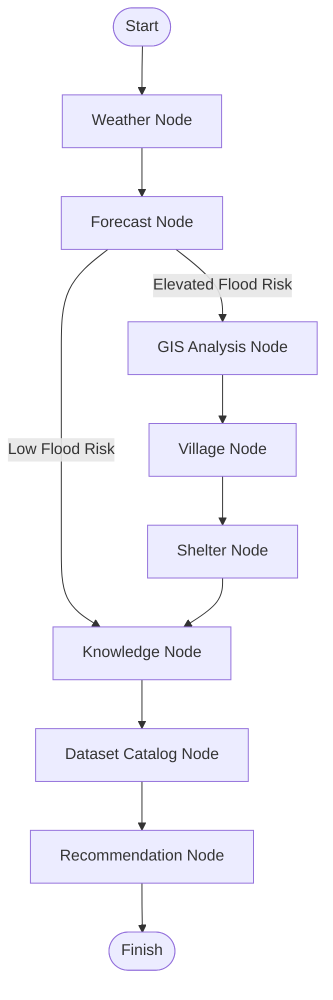

# LangGraph Architecture
## Flood-Aware Decision Intelligence Platform

| Property | Value |
|----------|-------|
| **Project** | Flood-Aware |
| **Document** | LangGraph Architecture Specification |
| **Version** | 1.0 |
| **Status** | Architecture Frozen (Sprint 10.0) |
| **Author** | Muhammad Ilyas |
| **Architecture Owner** | Flood-Aware Core Team |
| **Last Updated** | 2026-07-26 |
| **Applies To** | Sprint 10 – Sprint 18 |

---

# Scope

This document is the authoritative architectural specification for the **LangGraph-based AI Decision Engine** used by the Flood-Aware platform.

It defines the overall orchestration architecture that will be implemented beginning with **Sprint 10** and subsequently extended through **Sprint 18**.

This document specifies:

- LangGraph orchestration architecture
- Graph State design
- Decision graph nodes
- Conditional routing
- Evidence aggregation
- Execution tracing
- Error handling
- Tool contracts
- Architectural Decision Records (ADR)
- Future compatibility across upcoming sprints

This document intentionally **does not define implementation details**. Implementation belongs within the codebase, while this specification defines the architectural contracts that all implementations must follow.

Any architectural modification **must be reflected in this document before implementation**.

---

# Contents

## 1. Foundation
- 1.1 Purpose
- 1.2 Goals
- 1.3 Design Principles
- 1.4 Current Runtime Architecture
- 1.5 Target Runtime Architecture
- 1.6 Planner Strategy
- 1.7 Architecture Diagrams

---

## 2. Graph State
- 2.1 Overview
- 2.2 State Lifecycle
- 2.3 Ownership
- 2.4 State Evolution
- 2.5 Immutability
- 2.6 High-Level State Schema

---

## 3. LangGraph Nodes
- 3.1 Node Architecture
- 3.2 Weather Node
- 3.3 Forecast Node
- 3.4 GIS Analysis Node
- 3.5 Village Node
- 3.6 Shelter Node
- 3.7 Government Knowledge (RAG) Node
- 3.8 Dataset Catalog Node
- 3.9 Recommendation Node
- 3.10 Node Responsibilities
- 3.11 Node Inputs
- 3.12 Node Outputs
- 3.13 Failure Behaviour
- 3.14 Node Design Rules
- 3.15 Summary

---

## 4. Conditional Routing
- 4.1 Routing Philosophy
- 4.2 Routing Rules
- 4.3 Graph Edges
- 4.4 Entry Point
- 4.5 Exit Point
- 4.6 Mermaid Graph Diagram
- 4.7 Routing Summary

---

## 5. Evidence Bundle
- 5.1 Purpose
- 5.2 Ownership
- 5.3 Evidence Aggregation
- 5.4 Conflict Resolution
- 5.5 Confidence Propagation
- 5.6 Evidence Lifecycle
- 5.7 Compatibility with Sprint 11
- 5.8 Summary

---

## 6. Execution Trace
- 6.1 Purpose
- 6.2 Trace Lifecycle
- 6.3 Trace Metadata
- 6.4 Performance Metrics
- 6.5 Failure Recording
- 6.6 Trace Retention
- 6.7 Summary

---

## 7. Error Handling
- 7.1 Error Handling Philosophy
- 7.2 Recoverable Failures
- 7.3 Fatal Failures
- 7.4 Retry Strategy
- 7.5 Timeout Policy
- 7.6 Degraded Execution
- 7.7 Summary

---

## 8. Tool Contracts
- 8.1 Standard Node Contract
- 8.2 Tool Execution Guarantees
- 8.3 Determinism
- 8.4 Idempotency
- 8.5 Input Expectations
- 8.6 Output Expectations
- 8.7 Summary

---

## 9. Future Compatibility
- 9.1 Sprint 11 – LLM Reasoning
- 9.2 Sprint 12 – AI Assistant Chat
- 9.3 Sprint 13 – Scenario Simulator
- 9.4 Sprint 14 – Streamlit Dashboard
- 9.5 Sprint 16 – End-to-End Evaluation
- 9.6 Sprint 18 – Production Deployment
- 9.7 Summary

---

## 10. Architecture Decision Records (ADR)
- 10.1 Purpose
- 10.2 ADR-001 – Why LangGraph?
- 10.3 ADR-002 – Why Immutable Graph State?
- 10.4 ADR-003 – Why Recommendation Node Is the Only LLM Node?
- 10.5 ADR-004 – Why Deterministic Evidence Collection?
- 10.6 ADR-005 – Why Tool Independence?
- 10.7 ADR-006 – Why Execution Trace?
- 10.8 ADR-007 – Non-Goals
- 10.9 ADR-008 – Guiding Principles
- 10.10 Glossary
- 10.11 Summary

---

## 11. Implementation Contracts
- 11.1 Purpose
- 11.2 GraphState Contract
- 11.3 RuntimeMode Contract
- 11.4 EvidenceBundle Contract
- 11.5 ExecutionTrace Contract
- 11.6 Node Contract
- 11.7 Runtime Adapter Contract
- 11.8 Planner Strategy Contract
- 11.9 Graph Builder Contract
- 11.10 Folder Structure Contract
- 11.11 Compatibility Rules
- 11.12 Summary

---

# Appendices

## Appendix A — Glossary

Defines the terminology, concepts, and abbreviations used throughout this architecture specification.

---

## Appendix B — Revision History

Maintains the version history of this architecture specification and records future architectural revisions.

| Version | Date | Description |
|----------|------|-------------|
| 1.0 | 2026-07-26 | Initial LangGraph Architecture Specification created and frozen for Sprint 10.0 |

---

# 1. Purpose

## 1.1 Overview

This document defines the complete architectural design of the Flood-Aware decision engine after the migration from the deterministic sequential planner to a LangGraph-based orchestration framework.

The objective of this architecture is to transform Flood-Aware from a sequential rule-based execution pipeline into an intelligent graph-driven decision system capable of:

- reasoning over multiple evidence sources,
- dynamically selecting execution paths,
- aggregating verified evidence,
- producing explainable recommendations,
- supporting conversational AI,
- enabling future scenario simulation.

This document serves as the authoritative architectural specification for:

- Sprint 10 – LangGraph Decision Agent
- Sprint 11 – LLM Reasoning
- Sprint 12 – AI Assistant
- Sprint 13 – Scenario Simulator
- Sprint 14 – Streamlit Dashboard

Any implementation must follow this specification unless the architecture itself is revised.

---

# 2. Goals

The LangGraph migration has six primary goals.

## Goal 1 — Intelligent Orchestration

Replace deterministic sequential execution with dynamic graph execution where nodes are invoked only when required.

Instead of:

```
Weather
↓

Forecast
↓

GIS
↓

Village
↓

Shelter
↓

Knowledge
↓

Recommendation
```

the execution becomes:

```
Weather
↓

Forecast

↓

Decision

↓

only execute required nodes
```

This reduces unnecessary work while improving reasoning quality.

---

## Goal 2 — Evidence-Driven Decisions

Every recommendation produced by Flood-Aware must be grounded in factual evidence generated by verified system tools.

Recommendations must never rely solely on LLM knowledge.

The LLM acts only as a reasoning layer operating over structured evidence.

---

## Goal 3 — Explainability

Every recommendation must be fully traceable.

For every output the system must be able to answer:

- Which tools executed?
- Which evidence supported the decision?
- Which citations were used?
- Which nodes were skipped?
- Why was a recommendation produced?

Explainability is treated as a core architectural requirement rather than an optional feature.

---

## Goal 4 — Modular Growth

The architecture must support the addition of future capabilities without changing existing graph contracts.

Future examples include:

- River sensor integration
- Dam monitoring
- Satellite imagery
- Mobile crowd reports
- Additional AI agents
- Government APIs

New capabilities should be added as graph nodes rather than modifications to existing nodes.

---

## Goal 5 — Runtime Independence

Business logic must remain independent from LangGraph.

The application should depend on internal protocols rather than directly depending on LangGraph APIs.

This allows the orchestration engine to be replaced in the future without rewriting business logic.

---

## Goal 6 — AI-First Decision Platform

Flood-Aware is not designed as a generic GIS processing system.

Its GIS capabilities exist solely to provide verified spatial evidence for downstream AI reasoning.

Every subsystem ultimately serves one objective:

> Generate trustworthy, explainable, evidence-backed disaster management recommendations.

---

# 3. Design Principles

The following principles govern every architectural decision.

---

## 3.1 Evidence Before Intelligence

AI must never generate recommendations before evidence has been collected.

Every recommendation is derived from structured evidence.

Never:

```
User Question

↓

LLM

↓

Answer
```

Always:

```
User Question

↓

Evidence Collection

↓

Evidence Validation

↓

Evidence Aggregation

↓

LLM Reasoning

↓

Recommendation
```

---

## 3.2 Tool-First Architecture

All external knowledge enters the system through specialised tools.

Examples include:

- Weather Tool
- Forecast Tool
- GIS Analysis Tool
- Government Knowledge Tool
- Village Tool
- Shelter Tool
- Dataset Catalog Tool

The LLM never performs these responsibilities itself.

---

## 3.3 Single Responsibility

Each graph node performs one responsibility only.

Examples:

Weather Node

✓ Weather retrieval

✗ Recommendation generation

GIS Node

✓ Flood exposure analysis

✗ Risk reasoning

Recommendation Node

✓ Decision reasoning

✗ GIS processing

---

## 3.4 Immutable Evidence

Evidence objects are immutable.

Once produced they cannot be modified.

This guarantees:

- reproducibility
- auditability
- deterministic testing
- trustworthy AI reasoning

---

## 3.5 Explainability by Design

Every node execution produces trace metadata.

Execution trace is considered a first-class output of the runtime.

Every recommendation must include:

- supporting evidence
- execution history
- confidence
- citations
- reasoning

---

## 3.6 Framework Isolation

LangGraph is treated as infrastructure rather than business logic.

Flood-Aware owns:

- DecisionContext
- EvidenceBundle
- Recommendation
- Tool contracts
- Runtime protocols

LangGraph owns only graph execution.

---

## 3.7 Fail Gracefully

Node failures must never terminate the decision engine when sufficient evidence remains available.

The graph should continue executing whenever safe to do so.

Example:

```
Weather ✓

Forecast ✓

GIS timeout

↓

Continue

↓

Village

↓

Shelter

↓

Knowledge

↓

Recommendation
```

---

## 3.8 AI-First GIS Philosophy

The GIS subsystem is intentionally limited in scope.

It is **not** intended to evolve into a full-featured GIS framework.

The GIS layer exists exclusively to transform verified spatial datasets into immutable evidence for downstream AI reasoning.

It must not:

- perform recommendation generation,
- implement disaster management policies,
- orchestrate runtime execution,
- invoke language models,
- register AI tools.

Its only responsibility is producing deterministic spatial facts.

---

# 4. Current Runtime Architecture

Prior to Sprint 10, Flood-Aware uses a deterministic sequential planner.

The execution pipeline is fixed.

```
                User Request
                      │
                      ▼
                AIRuntime
                      │
                      ▼
             Sequential Planner
                      │
      ┌───────────────┴────────────────┐
      ▼                                ▼
Execute Tool 1                    Execute Tool 2
      ▼                                ▼
Execute Tool 3                    Execute Tool 4
      ▼
Execute Tool 5
      ▼
Recommendation
```

Characteristics:

- Static execution order
- Every configured tool executes
- No conditional routing
- No graph state
- Limited evidence aggregation
- Limited failure recovery
- Planner tightly controls orchestration

Although deterministic and reliable, this architecture cannot efficiently support advanced reasoning or dynamic workflows.

---

# 5. Target Runtime Architecture

Sprint 10 replaces the sequential planner with a LangGraph-driven orchestration engine.

```
                    User Request
                          │
                          ▼
                    AIRuntime
                          │
                          ▼
                Planner Strategy
                          │
                          ▼
                 LangGraph Runtime
                          │
          ┌───────────────┼────────────────┐
          ▼               ▼                ▼
      Weather Node   Forecast Node   Knowledge Node
                          │
                          ▼
                   Conditional Routing
                          │
          ┌───────────────┼────────────────┐
          ▼               ▼                ▼
      GIS Node      Village Node    Shelter Node
                          │
                          ▼
                 Evidence Aggregator
                          │
                          ▼
               Recommendation Node
                          │
                          ▼
               Structured Recommendation
```

Key improvements include:

- Dynamic routing
- Conditional execution
- Shared graph state
- Evidence aggregation
- Explainability
- Graceful failure handling
- Future extensibility

---

# 6. Planner Strategy

The planner is no longer responsible for executing every tool.

Instead, it becomes a strategy abstraction.

```
AIRuntime

↓

Planner Strategy

↓

Execution Engine
```

Current implementation:

```
SequentialPlanner
```

Future implementation:

```
LangGraphPlanner
```

AIRuntime remains unaware of the underlying orchestration engine.

This architectural separation provides several advantages:

- orchestration engine can be replaced,
- business logic remains unchanged,
- testing remains deterministic,
- future workflow engines can be evaluated without rewriting the application.

The planner strategy therefore becomes an infrastructure concern rather than a business concern.

---

# 7. Architecture Summary

The migration to LangGraph represents an architectural evolution rather than a complete rewrite.

The following components remain unchanged:

- Weather Tool
- Forecast Tool
- GIS Analysis Tool
- Government Knowledge Tool
- Village Tool
- Shelter Tool
- Dataset Catalog Tool
- Repository layer
- Service layer
- Use Cases
- API layer

Only the orchestration mechanism changes.

This preserves existing investments while enabling intelligent, explainable, evidence-driven decision making.

The remainder of this document defines the graph state, node specifications, routing logic, evidence model, execution tracing, and integration strategy that collectively form the Flood-Aware Decision Intelligence Platform.

# 2. Graph State

---

## 2.1 Purpose

The **Graph State** is the single source of truth shared by every LangGraph node during the execution of a disaster assessment workflow.

Rather than allowing nodes to communicate directly with one another, every node reads from and writes to a single immutable execution state. This ensures deterministic behaviour, predictable execution, simplified debugging, and complete explainability.

The Graph State replaces the implicit information passing performed by the previous `SequentialPlanner` while preserving the existing `DecisionContext` contract used throughout the application.

Every node must:

- Read only the information required for its task.
- Produce only its own evidence.
- Never overwrite evidence produced by another node.
- Never perform reasoning outside its responsibility.
- Never directly invoke another node.

The orchestration engine (LangGraph) alone is responsible for determining execution order.

---

## 2.2 Design Goals

The Graph State is designed around the following principles.

### Single Source of Truth

All runtime information exists inside one shared state object.

No node should maintain its own internal execution state.

---

### Immutable Evidence

Evidence generated by a node is considered immutable once written.

Nodes may append new evidence but must never modify evidence created by another node.

---

### Node Independence

Each node behaves as an isolated component.

Nodes know nothing about:

- execution order
- downstream nodes
- upstream nodes
- graph topology

They only receive Graph State and return Graph State.

---

### Explainability

Every modification to the Graph State must be traceable.

The final recommendation should always be explainable by examining:

- Graph State
- Evidence Bundle
- Execution Trace

without requiring the LLM.

---

### Fault Isolation

Failure of one node must not invalidate the entire graph.

Errors become part of Graph State instead of terminating execution whenever safe degradation is possible.

---

### Forward Compatibility

The Graph State is intentionally designed to support future capabilities including:

- conversational memory
- multi-turn reasoning
- scenario simulation
- streaming execution
- multi-agent collaboration

without changing the existing runtime contract.

---

## 2.3 Graph State Lifecycle

The lifecycle of the Graph State consists of six distinct phases.

### Phase 1 — Initialization

The runtime constructs an empty Graph State from the incoming API request.

At this stage the state contains only:

- Request metadata
- User query
- Geographic location
- Runtime configuration

No tools have executed.

---

### Phase 2 — Tool Execution

Each LangGraph node executes independently.

The node:

1. Reads Graph State.
2. Produces deterministic evidence.
3. Stores evidence inside its designated location.
4. Records execution metadata.

The node must not modify evidence owned by another node.

---

### Phase 3 — Evidence Aggregation

After all required nodes complete execution, the Evidence Aggregator combines all available evidence into one canonical structure.

Conflict detection and evidence validation occur here.

No reasoning occurs during aggregation.

---

### Phase 4 — LLM Reasoning

The aggregated evidence is provided to the LLM.

The LLM does not call tools.

The LLM does not calculate GIS values.

The LLM reasons only over verified evidence already present inside the Graph State.

---

### Phase 5 — Recommendation

The LLM returns a structured recommendation.

The recommendation becomes part of Graph State.

Execution Trace is finalized.

---

### Phase 6 — Response

The API serializes:

- Recommendation
- Evidence
- Citations
- Execution Trace

The completed Graph State is then discarded.

No runtime state persists between requests.

---

# 2.4 Graph State Schema

The Graph State consists of eight logical sections.

```
GraphState
│
├── Request
├── Context
├── Tool Results
├── Evidence
├── Recommendation
├── Execution Trace
├── Errors
└── Metadata
```

Each section has a single owner responsible for writing to it.

---

## 2.5 Request Section

### Purpose

Stores immutable request information supplied by the client.

### Fields

| Field | Type | Description |
|--------|------|-------------|
| request_id | UUID | Unique execution identifier |
| timestamp | datetime | Request creation time |
| user_query | str | Original user prompt |
| latitude | float | User latitude |
| longitude | float | User longitude |
| language | str | Preferred response language |

### Owner

Runtime

### Writable By

Runtime only.

---

## 2.6 Context Section

### Purpose

Stores shared execution context used throughout the graph.

### Fields

| Field | Type |
|--------|------|
| flood_severity | FloodSeverity |
| execution_mode | RuntimeMode |
| routing_flags | dict |
| scenario | Optional[ScenarioRequest] |

### Owner

Routing Engine

### Writable By

Routing Engine only.

---

## 2.7 Tool Results Section

Each node writes exactly one Tool Result.

```
tool_results
│
├── weather
├── forecast
├── gis
├── village
├── shelter
├── dataset_catalog
└── knowledge
```

Each result is immutable.

Example:

```
tool_results.forecast
```

contains only

```
ForecastResult
```

returned by the Forecast Tool.

No node may modify another tool's result.

---

## 2.8 Evidence Section

The Evidence section stores the aggregated output produced by the Evidence Aggregator.

```
EvidenceBundle
│
├── Forecast Evidence
├── GIS Evidence
├── Population Evidence
├── Infrastructure Evidence
├── Weather Evidence
├── Village Evidence
├── Shelter Evidence
├── Knowledge Evidence
└── Dataset Evidence
```

Unlike Tool Results, the Evidence section is cross-tool.

This is the structure consumed by the LLM.

---

## 2.9 Recommendation Section

Contains the final AI recommendation.

Fields include:

| Field | Description |
|--------|-------------|
| summary | High-level recommendation |
| reasoning | Structured explanation |
| confidence | Overall confidence score |
| citations | Supporting knowledge references |
| actions | Ordered response actions |

Only the Recommendation Node may write this section.

---

## 2.10 Execution Trace Section

Stores execution metadata for every graph node.

Each node appends one trace entry.

Example:

```
ExecutionTrace
│
├── Weather Node
├── Forecast Node
├── GIS Node
├── Village Node
├── Shelter Node
├── Knowledge Node
└── Recommendation Node
```

Each trace contains:

- node name
- start time
- end time
- duration
- status
- skipped flag
- error (if any)

This section enables complete runtime explainability.

---

## 2.11 Errors Section

Errors are isolated from business logic.

Each node records its own failures without affecting unrelated nodes.

Example:

```
errors
│
├── weather
├── forecast
├── gis
└── knowledge
```

Errors never overwrite successful evidence.

The routing engine determines whether graph execution should continue.

---

## 2.12 Metadata Section

Stores execution metadata not directly related to reasoning.

Examples include:

- graph version
- runtime version
- model identifier
- execution duration
- token usage
- API version

This section exists for observability and monitoring only.

It must never influence AI reasoning.

---

## 2.13 Ownership Rules

To maintain deterministic execution, every section has exactly one owner.

| Section | Owner |
|----------|-------|
| Request | Runtime |
| Context | Routing Engine |
| Tool Results | Individual Tool Nodes |
| Evidence | Evidence Aggregator |
| Recommendation | Recommendation Node |
| Execution Trace | All Nodes (append only) |
| Errors | Individual Tool Nodes |
| Metadata | Runtime |

No component may write outside its ownership boundary.

---

## 2.14 State Invariants

The following rules must always hold true.

1. Tool Results are immutable after creation.

2. Evidence is derived only from Tool Results.

3. Recommendation is derived only from Evidence.

4. Execution Trace is append-only.

5. Nodes never overwrite another node's data.

6. Missing evidence must be represented explicitly rather than omitted.

7. Graph execution must remain deterministic given identical inputs.

8. The Graph State must remain serializable for debugging and replay.

---

## 2.15 Summary

The Graph State forms the backbone of the LangGraph runtime.

It provides:

- deterministic execution
- strict ownership boundaries
- immutable evidence
- explainable reasoning
- fault isolation
- future extensibility

Every subsequent architectural component—including routing, evidence aggregation, recommendation generation, conversational memory, and scenario simulation—operates exclusively through this shared execution state.

# 3. LangGraph Nodes

---

## 3.1 Overview

The LangGraph workflow is composed of independent execution nodes.

Each node has one clearly defined responsibility.

Nodes communicate only through the shared **Graph State**.

Nodes never invoke one another directly.

Nodes never perform reasoning outside their assigned responsibility.

Every node follows the same execution contract.

```
Read GraphState
        │
        ▼
Validate Inputs
        │
        ▼
Execute One Responsibility
        │
        ▼
Store Output
        │
        ▼
Append Execution Trace
        │
        ▼
Return Updated GraphState
```

---

# 3.2 Common Node Contract

Every LangGraph node must satisfy the following contract.

### Inputs

- GraphState

### Outputs

- Updated GraphState

### Responsibilities

A node may:

- Read Graph State
- Execute exactly one domain responsibility
- Produce deterministic output
- Store its own output
- Append execution trace

A node must never:

- Modify another node's output
- Perform AI reasoning
- Decide graph routing
- Call downstream nodes
- Mutate existing evidence

---

# 3.3 Weather Node

---

## Purpose

Retrieve current meteorological conditions for the requested location.

The Weather Node provides environmental context only.

It does not predict flooding.

---

## Reads

- Request.latitude
- Request.longitude

---

## Executes

Weather Tool

---

## Produces

```
ToolResult.weather
```

containing

```
WeatherResult
```

---

## Writes

```
tool_results.weather
```

---

## Preconditions

- Valid coordinates exist

---

## Postconditions

WeatherResult stored.

Execution Trace updated.

---

## Failure Behaviour

If weather retrieval fails:

- Store WeatherError
- Continue graph execution

Weather information is considered optional.

---

# 3.4 Forecast Node

---

## Purpose

Retrieve the latest GloFAS discharge forecast.

This node supplies hydrological evidence.

It does not estimate impact.

---

## Reads

- Request.latitude
- Request.longitude

---

## Executes

Forecast Tool

---

## Produces

```
ForecastResult
```

---

## Writes

```
tool_results.forecast
```

---

## Preconditions

Coordinates available.

Forecast snapshots available.

---

## Postconditions

ForecastResult stored.

---

## Failure Behaviour

Forecast retrieval failure:

- Store ForecastError
- Continue execution

Recommendation confidence may decrease.

---

# 3.5 GIS Analysis Node

---

## Purpose

Convert forecast severity into spatial flood evidence.

The GIS node performs deterministic spatial analysis only.

It never interprets flood risk.

---

## Reads

- ForecastResult
- DEM
- WorldPop
- OSM layers

---

## Executes

GIS Analysis Tool

Internally performs:

- Flood Zone Generation
- Population Exposure
- Infrastructure Impact
- DEM Sampling
- Flood Evidence Assembly

---

## Produces

```
FloodEvidence
```

---

## Writes

```
tool_results.gis
```

---

## Preconditions

ForecastResult exists.

Forecast severity exceeds routing threshold.

---

## Postconditions

FloodEvidence stored.

---

## Failure Behaviour

GIS failures:

- Store GISError
- Continue graph execution

Graph does not terminate.

---

# 3.6 Village Node

---

## Purpose

Retrieve villages located within or near the affected area.

Provides settlement information only.

---

## Reads

- Flood Zone

---

## Executes

Village Tool

---

## Produces

VillageResult

---

## Writes

```
tool_results.village
```

---

## Preconditions

Flood Zone exists.

---

## Failure Behaviour

Store VillageError.

Continue execution.

---

# 3.7 Shelter Node

---

## Purpose

Locate candidate emergency shelters.

No ranking occurs here.

---

## Reads

- Flood Zone

---

## Executes

Shelter Tool

---

## Produces

ShelterResult

---

## Writes

```
tool_results.shelter
```

---

## Preconditions

Flood Zone exists.

---

## Failure Behaviour

Store ShelterError.

Continue execution.

---

# 3.8 Dataset Catalog Node

---

## Purpose

Retrieve authoritative datasets relevant to the current disaster.

Provides metadata only.

---

## Reads

GraphState

---

## Executes

Dataset Catalog Tool

---

## Produces

DatasetCatalogResult

---

## Writes

```
tool_results.dataset_catalog
```

---

## Failure Behaviour

Optional node.

Failure does not terminate graph.

---

# 3.9 Government Knowledge Node

---

## Purpose

Retrieve supporting disaster-management guidance.

Uses RAG only.

No AI reasoning occurs here.

---

## Reads

Forecast

GIS Evidence

Village

Shelter

---

## Executes

Government Knowledge Tool

---

## Produces

KnowledgeResult

including

- retrieved passages
- citations
- document identifiers

---

## Writes

```
tool_results.knowledge
```

---

## Failure Behaviour

Knowledge retrieval failure:

Store KnowledgeError.

Continue execution.

---

# 3.10 Evidence Aggregator Node

---

## Purpose

Combine all deterministic tool outputs into one canonical evidence package.

No reasoning occurs.

---

## Reads

All Tool Results.

---

## Produces

EvidenceBundle

---

## Writes

```
evidence
```

---

## Responsibilities

- Aggregate evidence
- Validate evidence
- Detect conflicts
- Remove duplicates
- Preserve provenance

---

## Failure Behaviour

Aggregation failure terminates graph.

EvidenceBundle is mandatory.

---

# 3.11 Recommendation Node

---

## Purpose

Generate the final disaster recommendation.

This is the only node permitted to invoke the LLM.

---

## Reads

EvidenceBundle

---

## Executes

LLM Client

---

## Produces

Recommendation

---

## Writes

```
recommendation
```

---

## Responsibilities

Generate

- Situation summary
- Recommended actions
- Supporting rationale
- Confidence
- Citations

---

## Restrictions

The Recommendation Node:

- never calls tools
- never computes GIS values
- never modifies evidence
- never fabricates facts

It reasons exclusively over EvidenceBundle.

---

# 3.12 Node Execution Order

The default execution flow is:

```
START

   │

   ▼

Weather Node

   │

   ▼

Forecast Node

   │

   ▼

GIS Analysis Node

   │

   ├───────────────┐
   ▼               ▼

Village Node   Shelter Node

   │               │

   └──────┬────────┘

          ▼

Dataset Catalog Node

          │

          ▼

Government Knowledge Node

          │

          ▼

Evidence Aggregator

          │

          ▼

Recommendation Node

          │

          ▼

END
```

Routing rules may skip nodes.

Graph topology remains unchanged.

---

# 3.13 Node Ownership

| Node | Owns |
|-------|------|
| Weather | WeatherResult |
| Forecast | ForecastResult |
| GIS | FloodEvidence |
| Village | VillageResult |
| Shelter | ShelterResult |
| Dataset Catalog | DatasetCatalogResult |
| Knowledge | KnowledgeResult |
| Evidence Aggregator | EvidenceBundle |
| Recommendation | Recommendation |

Nodes may write only to their owned section.

---

# 3.14 Node Design Rules

Every node must satisfy the following engineering rules.

1. Single Responsibility Principle.

2. Deterministic execution.

3. No hidden state.

4. No mutable shared objects.

5. One owner per output.

6. Tool execution only.

7. No AI reasoning except Recommendation Node.

8. Execution Trace appended exactly once.

9. Errors isolated.

10. Graph State returned after every execution.

---

# 3.15 Summary

The LangGraph architecture decomposes the disaster-analysis workflow into independent, deterministic execution nodes.

Each node has a single responsibility, a clearly defined contract, and exclusive ownership of its output.

This architecture enables:

- deterministic execution
- explainable recommendations
- independent testing
- fault isolation
- future multi-agent expansion
- seamless integration with Sprint 11 LLM reasoning
- conversational support in Sprint 12
- scenario simulation in Sprint 13
- dashboard visualisation in Sprint 14

The Recommendation Node is intentionally the only component permitted to perform AI reasoning. All preceding nodes exist solely to gather, validate, and structure factual evidence for grounded decision-making.

# 4. Conditional Routing

## 4.1 Purpose

The LangGraph workflow is intentionally designed as a **dynamic execution graph** rather than a fixed sequential pipeline.

Unlike the previous `SequentialPlanner`, the graph allows execution paths to change depending on the operational situation while preserving deterministic behaviour.

Routing decisions are based entirely on structured evidence already present in the `GraphState`.

Nodes never inspect external systems directly to decide routing.

---

## 4.2 Routing Philosophy

The routing layer follows five guiding principles.

### 1. Evidence-Driven

Routing decisions are based only on validated facts contained in the Graph State.

No routing decision may depend on assumptions or LLM reasoning.

---

### 2. Deterministic

Identical inputs must always produce the same execution path.

The routing layer must not introduce randomness.

---

### 3. Fail-Safe

If a node cannot execute successfully, the graph continues whenever meaningful evidence still exists.

Failure of one tool must not terminate the entire workflow unless the remaining analysis would become invalid.

---

### 4. Explainable

Every routing decision must be visible in the Execution Trace.

The system must always be able to answer:

- Why was a node executed?
- Why was a node skipped?
- Why did execution terminate?

---

### 5. Extensible

New nodes may be inserted into the workflow without modifying existing node contracts.

This enables future expansion while preserving architectural stability.

---

## 4.3 Graph Entry Point

Every execution begins from a single entry node.

```text
Start
```

The entry node initializes the Graph State and validates the incoming request.

No domain-specific analysis occurs before state initialization.

---

## 4.4 Graph Exit Point

Execution completes only after the Recommendation Node produces the final response.

```text
Recommendation
        │
        ▼
      Finish
```

The completed Graph State, Recommendation, and Execution Trace are returned to the AI Runtime.

---

## 4.5 High-Level Routing Rules

The routing layer applies only high-level execution decisions.

### Weather Node

- Always executed.
- Provides current environmental conditions for downstream analysis.

---

### Forecast Node

- Always executed.
- Produces the authoritative flood forecast used for all subsequent routing decisions.

---

### GIS Analysis Node

- Executed only when the forecast indicates elevated flood risk.
- Skipped when forecast severity remains below the configured threshold.

---

### Village Node

- Executed whenever affected geographic areas must be identified.
- Skipped only when no meaningful flood impact exists.

---

### Shelter Node

- Executed only after exposed villages have been identified.
- Skipped when no exposed communities require evacuation support.

---

### Knowledge Node

- Executed whenever recommendations require disaster-management guidance, emergency procedures, or government documentation.

---

### Dataset Catalog Node

- Executed only when additional structured datasets are required to support decision making.

---

### Recommendation Node

- Always executed.
- Consumes all available evidence.
- Produces the final grounded recommendation.

---

## 4.6 Skip Logic

Skipping a node is considered a valid execution outcome.

A skipped node is **not** treated as an error.

Instead, the Execution Trace records:

- skipped node
- reason for skipping
- routing decision

This preserves full explainability while avoiding unnecessary computation.

---

## 4.7 Failure Routing

When a node encounters an operational failure:

- the failure is recorded,
- the Graph State remains valid,
- downstream execution continues whenever sufficient evidence remains available.

Only failures that invalidate the overall analysis terminate the workflow.

This approach enables graceful degradation instead of complete pipeline failure.

---

## 4.8 Routing Guarantees

The routing layer guarantees that:

- every executed node receives a valid Graph State,
- every node executes at most once per request,
- execution order remains deterministic,
- skipped nodes are explicitly recorded,
- routing decisions are fully traceable,
- evidence produced by completed nodes is preserved,
- no routing decision depends on LLM output.

---

## 4.9 High-Level Graph



---

## 4.10 Architectural Summary

The routing layer defines **how evidence flows through the disaster-analysis workflow**, not how individual tools operate.

Its responsibilities are limited to:

- selecting the next node,
- skipping unnecessary analysis,
- preserving deterministic execution,
- recording routing decisions,
- ensuring that the Recommendation Node receives the best available evidence.

By separating routing from tool implementation, Flood-Aware remains modular, explainable, and extensible while providing a stable foundation for:

- Sprint 10 – LangGraph Decision Agent
- Sprint 11 – LLM Reasoning & Grounded Recommendation
- Sprint 12 – AI Assistant Chat
- Sprint 13 – Scenario Simulator
- Sprint 14 – Streamlit Dashboard

# 5. Evidence Bundle

## 5.1 Purpose

The **Evidence Bundle** is the authoritative collection of structured facts gathered during a single LangGraph execution.

It represents the complete factual understanding of the disaster situation immediately before AI reasoning begins.

The Recommendation Node must consume **only** the Evidence Bundle when generating recommendations.

The Evidence Bundle exists to separate:

- **data collection** (tool execution), from
- **decision making** (LLM reasoning).

This separation guarantees that AI recommendations remain fully grounded in verified evidence rather than inferred assumptions.

---

## 5.2 Architectural Role

The Evidence Bundle serves as the single source of truth for all downstream reasoning.

It provides:

- unified access to evidence produced by every execution node,
- a consistent interface for the Recommendation Node,
- deterministic aggregation of heterogeneous tool outputs,
- traceable provenance for every fact,
- confidence propagation across the workflow.

It does **not** perform:

- reasoning,
- prioritisation,
- recommendation generation,
- evidence modification,
- conflict resolution through AI.

Its sole responsibility is to organise validated evidence into one structured object.

---

## 5.3 Ownership

Evidence ownership is intentionally strict.

Each node is the **exclusive owner** of the evidence it produces.

No downstream node may overwrite or modify evidence produced by another node.

Ownership is defined as follows:

| Node | Owned Evidence |
|------|----------------|
| Weather Node | WeatherResult |
| Forecast Node | ForecastResult |
| GIS Analysis Node | FloodEvidence |
| Village Node | VillageResult |
| Shelter Node | ShelterResult |
| Knowledge Node | RAGResult |
| Dataset Catalog Node | DatasetCatalogResult |

The Evidence Bundle stores references to these immutable outputs without altering them.

---

## 5.4 Design Principles

The Evidence Bundle follows six architectural principles.

### Single Source of Truth

Every verified fact exists only once.

Duplicate copies are not created.

---

### Immutable

Evidence cannot change after it has been produced.

If new evidence becomes available, a new Graph State is created.

---

### Deterministic

The same Graph State always produces the same Evidence Bundle.

---

### Traceable

Every evidence item must identify:

- producing node,
- execution timestamp,
- confidence,
- provenance,
- execution trace identifier.

---

### Explainable

Every recommendation generated by the AI must be traceable back to one or more evidence items inside the bundle.

---

### Extensible

Future tools can contribute new evidence without changing existing evidence contracts.

---

# 5.5 Evidence Aggregation

The Evidence Aggregator executes after all required graph nodes complete.

Its responsibility is to collect immutable outputs into one structured Evidence Bundle.

Aggregation consists of four steps:

1. Collect evidence from completed nodes.
2. Validate evidence integrity.
3. Detect conflicts.
4. Produce the final immutable Evidence Bundle.

No evidence is recalculated during aggregation.

The aggregator simply assembles previously validated outputs.

---

## 5.6 High-Level Evidence Structure

Conceptually, the Evidence Bundle contains:

- Weather evidence
- Forecast evidence
- GIS flood analysis evidence
- Village exposure evidence
- Shelter availability evidence
- Government knowledge evidence
- Dataset metadata
- Confidence summary
- Conflict summary
- Execution metadata

Each section remains independent.

The Recommendation Node decides how much weight to assign each evidence category.

---

## 5.7 Evidence Categories

### Weather Evidence

Contains current observed weather conditions.

Typical information includes:

- temperature,
- rainfall,
- humidity,
- wind,
- atmospheric conditions.

---

### Forecast Evidence

Contains deterministic hydrological forecast outputs.

Typical information includes:

- discharge values,
- forecast horizon,
- forecast severity,
- forecast metadata,
- provenance.

---

### GIS Evidence

Contains spatial flood analysis.

Typical information includes:

- flood polygons,
- flood severity,
- exposed population,
- affected infrastructure,
- elevation,
- GIS confidence.

---

### Village Evidence

Contains exposed settlements.

Typical information includes:

- affected villages,
- administrative information,
- estimated population,
- priority ordering.

---

### Shelter Evidence

Contains emergency shelter availability.

Typical information includes:

- nearest shelters,
- capacity,
- occupancy,
- accessibility.

---

### Knowledge Evidence

Contains retrieved government guidance.

Typical information includes:

- retrieved passages,
- citations,
- document identifiers,
- retrieval confidence.

---

### Dataset Evidence

Contains dataset provenance.

Typical information includes:

- dataset names,
- version,
- publication date,
- metadata,
- licensing information.

---

# 5.8 Conflict Detection

Different tools may occasionally produce inconsistent information.

The Evidence Aggregator identifies these inconsistencies but does not attempt to resolve them.

Instead, conflicts are explicitly recorded.

Examples include:

- forecast indicates low flood risk while GIS indicates severe flooding,
- village list inconsistent with flood extent,
- shelter capacity lower than exposed population,
- retrieved government guidance contradicts current operational conditions.

The Recommendation Node receives these conflicts and explains them when necessary.

---

## 5.9 Conflict Handling Principles

Conflict detection follows four rules.

### Detect

Identify inconsistent evidence.

---

### Record

Store conflict information inside the Evidence Bundle.

---

### Preserve

Do not delete either evidence source.

Both remain available.

---

### Explain

Allow the Recommendation Node to explain why conflicting evidence exists.

---

# 5.10 Confidence Propagation

Every evidence item includes its own confidence.

Confidence is never invented by the Recommendation Node.

Instead, confidence originates from individual tools and propagates through the workflow.

For example:

- Weather Tool confidence
- Forecast Tool confidence
- GIS Analysis confidence
- RAG retrieval confidence

The Evidence Bundle preserves these individual confidence values.

It may also expose an overall confidence summary representing the completeness and consistency of the collected evidence.

This summary is informational only and must never replace the confidence of individual evidence sources.

---

## 5.11 Confidence Principles

Confidence propagation follows five rules.

### Originates at the Source

Only the producing tool assigns confidence.

---

### Immutable

Confidence values cannot be modified downstream.

---

### Independent

Each evidence category retains its own confidence.

---

### Transparent

Confidence values remain visible throughout the workflow.

---

### Explainable

The Recommendation Node may reference confidence values when explaining uncertainty but must never fabricate or inflate them.

---

# 5.12 Evidence Bundle Lifecycle

```
Tool Execution
      │
      ▼
Immutable Tool Results
      │
      ▼
Evidence Aggregator
      │
      ▼
Conflict Detection
      │
      ▼
Confidence Summary
      │
      ▼
Evidence Bundle
      │
      ▼
Recommendation Node
```

---

# 5.13 Architectural Guarantees

The Evidence Bundle guarantees that:

- every evidence item has one owner,
- evidence remains immutable,
- provenance is preserved,
- confidence values remain transparent,
- conflicts are explicitly recorded,
- aggregation never performs reasoning,
- aggregation never modifies evidence,
- recommendations are generated only from validated evidence.

---

# 5.14 Summary

The Evidence Bundle is the central factual representation of a disaster situation within Flood-Aware.

It consolidates validated outputs from every execution node into one immutable, explainable structure while preserving ownership, provenance, confidence, and conflict information.

By ensuring that the Recommendation Node consumes only the Evidence Bundle, the architecture cleanly separates **evidence collection** from **AI reasoning**, enabling deterministic execution, grounded recommendations, transparent explainability, and seamless integration with future conversational, scenario simulation, and dashboard capabilities.

# 6. Execution Trace

## 6.1 Purpose

The **Execution Trace** is the complete operational record of a single LangGraph execution.

It exists to provide full observability into how the system reached a recommendation without exposing implementation details to end users.

Unlike the Evidence Bundle, which stores **what was discovered**, the Execution Trace records **how it was discovered**.

Its primary objectives are to:

- support explainability,
- enable debugging,
- measure runtime performance,
- diagnose failures,
- audit decision workflows,
- provide reproducible execution histories.

The Execution Trace is generated automatically during graph execution and is preserved until the workflow completes.

---

# 6.2 Design Principles

The Execution Trace follows the same engineering principles as the rest of the LangGraph architecture.

## Deterministic

Identical executions produce equivalent traces.

---

## Immutable

Once a node finishes execution, its trace record cannot be modified.

---

## Chronological

Trace entries are stored in execution order.

---

## Independent

Each node owns only its own trace entry.

Nodes cannot modify trace records produced by other nodes.

---

## Lightweight

The Execution Trace stores metadata only.

It must never duplicate large evidence payloads.

---

## Explainable

Every recommendation generated by the Recommendation Node must be traceable back to the execution history.

---

# 6.3 Trace Lifecycle

Every LangGraph execution creates one Execution Trace.

The lifecycle is:

```
Graph Starts
      │
      ▼
Execution Trace Created
      │
      ▼
Node Begins
      │
      ▼
Node Trace Recorded
      │
      ▼
Next Node
      │
      ▼
Graph Completes
      │
      ▼
Execution Trace Frozen
```

After completion, the trace becomes read-only.

---

# 6.4 Trace Ownership

Each node owns exactly one trace record.

Ownership is defined as follows:

| Node | Trace Owner |
|------|-------------|
| Weather Node | Weather execution |
| Forecast Node | Forecast execution |
| GIS Analysis Node | GIS execution |
| Village Node | Village execution |
| Shelter Node | Shelter execution |
| Knowledge Node | Knowledge retrieval execution |
| Dataset Node | Dataset execution |
| Recommendation Node | AI reasoning execution |

No node may alter another node's execution record.

---

# 6.5 Execution Metadata

Each trace entry records operational metadata describing the execution.

Typical metadata includes:

- node name,
- execution order,
- execution status,
- start timestamp,
- finish timestamp,
- execution duration,
- tool invoked,
- retry count,
- timeout status,
- evidence produced,
- confidence returned,
- execution identifier.

The trace intentionally stores references to evidence rather than duplicating evidence itself.

---

# 6.6 Node Status

Every node execution ends with one status.

Supported statuses include:

| Status | Meaning |
|---------|----------|
| Pending | Node not yet executed |
| Running | Node currently executing |
| Completed | Node executed successfully |
| Skipped | Routing intentionally bypassed the node |
| Failed | Execution ended with an error |
| Timed Out | Maximum execution time exceeded |

These statuses provide a complete picture of graph execution without requiring inspection of internal implementation.

---

# 6.7 Performance Metrics

The Execution Trace captures operational metrics to support monitoring and optimisation.

Typical performance information includes:

- execution duration,
- cumulative graph runtime,
- tool latency,
- AI reasoning latency,
- retrieval latency,
- GIS processing latency,
- forecast processing latency,
- total workflow duration.

These metrics are informational only.

They must never influence routing decisions during execution.

---

## Performance Principles

Performance metrics follow four rules.

### Passive

Metrics are observed, never used for reasoning.

---

### Deterministic

Metrics describe execution but do not alter execution.

---

### Comparable

Measurements remain consistent across executions.

---

### Auditable

Performance history can be analysed after execution.

---

# 6.8 Failure Recording

Failures are recorded explicitly rather than hidden.

Every failure includes enough metadata to explain:

- what failed,
- where it failed,
- when it failed,
- why it failed,
- whether execution continued.

The trace records failures even when graceful degradation allows the graph to continue.

---

# 6.9 Failure Categories

Typical failure categories include:

- tool unavailable,
- timeout,
- invalid input,
- validation failure,
- missing data,
- retrieval failure,
- API failure,
- unexpected internal error.

Failures are recorded as operational metadata rather than exceptions inside the trace.

---

# 6.10 Graceful Degradation

LangGraph is designed to continue execution whenever safe.

Examples include:

- Weather Tool timeout → continue with Forecast Tool.
- GIS skipped because forecast severity is normal.
- Knowledge retrieval failure → continue using remaining evidence.
- Dataset metadata unavailable → continue with warning.

Every degraded execution is recorded inside the Execution Trace.

---

# 6.11 Skipped Nodes

A skipped node is **not** considered a failure.

Skip events occur because routing intentionally bypasses execution.

Examples include:

- Forecast severity below GIS threshold.
- No exposed villages requiring shelter search.
- Recommendation generated without Knowledge Node because no policy question exists.

Skipped nodes remain visible in the trace to explain why they did not execute.

---

# 6.12 Relationship with Evidence Bundle

The Execution Trace and Evidence Bundle have distinct responsibilities.

| Execution Trace | Evidence Bundle |
|-----------------|-----------------|
| Records execution history | Stores validated facts |
| Operational metadata | Disaster evidence |
| Performance metrics | Population, GIS, Forecast, Weather, RAG outputs |
| Failures and skips | Evidence only |
| Explainability support | AI reasoning input |

The Recommendation Node consumes the Evidence Bundle while referencing the Execution Trace when generating explanations.

---

# 6.13 Future Compatibility

The Execution Trace is designed to support future capabilities including:

- multi-agent execution,
- conversational memory,
- scenario simulation,
- dashboard visualisation,
- performance analytics,
- operational auditing,
- recommendation explainability,
- evaluation framework integration.

Future extensions must add metadata without breaking existing trace contracts.

---

# 6.14 Summary

The Execution Trace provides the operational history of every LangGraph execution.

It records **how** the system reached a recommendation by capturing node execution order, metadata, performance metrics, skipped nodes, failures, and execution outcomes while remaining completely independent from the Evidence Bundle.

Together with the Evidence Bundle, it enables deterministic execution, comprehensive observability, transparent explainability, robust debugging, and a complete audit trail for every disaster analysis performed by Flood-Aware.

# 7. Error Handling

## 7.1 Purpose

The LangGraph execution engine must remain resilient in the presence of partial failures while preserving deterministic behaviour and grounded recommendations.

Error handling is designed to ensure that:

- a single tool failure does not unnecessarily terminate the workflow,
- recommendations are generated whenever sufficient evidence exists,
- failures are explicitly recorded,
- execution remains predictable,
- no hidden recovery logic exists.

The system prioritises **graceful degradation** over complete workflow termination whenever doing so does not compromise recommendation quality.

---

# 7.2 Design Principles

All error handling follows the core architectural principles.

## Fail Fast

Configuration errors, invalid graph definitions, and corrupted state must stop execution immediately.

---

## Fail Safely

Operational tool failures should degrade gracefully whenever possible.

---

## Deterministic

The same failure under the same conditions produces the same execution behaviour.

---

## Explicit

Every failure must be visible in the Execution Trace.

Silent failures are prohibited.

---

## Isolated

Failures are contained within the node that produced them.

Nodes cannot corrupt Graph State owned by other nodes.

---

## Grounded

The Recommendation Node must never invent missing evidence to compensate for failures.

---

# 7.3 Error Categories

Errors are divided into two major categories.

## Recoverable Failures

Recoverable failures affect only a single node.

Graph execution may continue.

Examples include:

- temporary API timeout,
- unavailable external service,
- missing optional dataset,
- retrieval returning zero results,
- GIS node skipped due to routing,
- forecast unavailable but weather still available.

Recoverable failures are recorded and marked as degraded execution.

---

## Fatal Failures

Fatal failures prevent the graph from producing a trustworthy recommendation.

Execution must terminate.

Examples include:

- corrupted Graph State,
- invalid state schema,
- missing mandatory configuration,
- graph compilation failure,
- invalid routing configuration,
- unrecoverable planner error,
- Recommendation Node unable to access minimum required evidence.

Fatal failures immediately stop execution.

---

# 7.4 Node Failure Isolation

Every node is responsible for handling its own operational failures.

A failing node:

- records its failure,
- updates its execution status,
- returns a deterministic failure result,
- never corrupts Graph State,
- never modifies evidence owned by another node.

Node failures do not automatically propagate through the graph unless they invalidate downstream execution.

---

# 7.5 Recoverable Failure Strategy

When a recoverable failure occurs, LangGraph performs the following sequence.

```
Node Starts
      │
      ▼
Failure Occurs
      │
      ▼
Failure Recorded
      │
      ▼
Retry (if permitted)
      │
      ▼
Retry Failed
      │
      ▼
Node marked Failed
      │
      ▼
Graph evaluates routing
      │
      ▼
Continue execution if possible
```

This behaviour ensures that useful recommendations can still be produced from available evidence.

---

# 7.6 Fatal Failure Strategy

Fatal failures terminate execution immediately.

```
Fatal Error
      │
      ▼
Execution Trace Updated
      │
      ▼
Graph Stops
      │
      ▼
Error Returned
```

No Recommendation Node execution occurs after a fatal failure.

---

# 7.7 Retry Policy

Retries exist only for transient operational failures.

Retries are **never** used to compensate for deterministic validation errors.

Typical retry candidates include:

- temporary network interruption,
- transient HTTP failures,
- temporary API unavailability,
- temporary vector database connection loss.

Retries are **not** permitted for:

- invalid inputs,
- schema violations,
- missing required evidence,
- corrupted state,
- programming errors.

---

## Retry Rules

The retry policy follows these rules.

1. Retries are deterministic.

2. Retry count is bounded.

3. Every retry is recorded.

4. Retry history is included in the Execution Trace.

5. Retry exhaustion results in graceful degradation or fatal failure depending on node importance.

---

# 7.8 Timeout Policy

Each node executes within an implementation-defined maximum duration.

Timeouts prevent a single slow component from blocking the entire workflow.

Typical timeout candidates include:

- Weather API,
- Forecast API,
- RAG retrieval,
- LLM reasoning,
- GIS processing.

When a timeout occurs:

1. execution stops for that node,
2. timeout is recorded,
3. retry policy is evaluated,
4. graph routing determines whether execution continues.

---

# 7.9 Degraded Execution

A degraded execution occurs when one or more recoverable failures are encountered but sufficient evidence remains to continue.

Examples include:

- Weather Tool unavailable while Forecast Tool succeeds.
- Knowledge Node returns no supporting documents.
- GIS node intentionally skipped.
- Dataset Tool unavailable.
- Shelter Tool returns no nearby shelters.

Degraded execution remains a successful graph execution provided recommendation quality remains acceptable.

---

# 7.10 Recommendation Guardrails

The Recommendation Node performs additional validation before generating AI output.

Recommendations must not be produced when:

- mandatory evidence is missing,
- evidence conflicts cannot be resolved,
- Graph State is invalid,
- confidence falls below the configured threshold,
- supporting evidence is unavailable.

Instead, the system returns a structured failure indicating that reliable recommendations cannot be generated.

---

# 7.11 Error Recording

Every error recorded by the graph includes sufficient metadata for auditing.

Typical information includes:

- node name,
- failure category,
- execution status,
- retry count,
- timeout indicator,
- timestamp,
- human-readable reason.

Errors are operational metadata and are never interpreted as disaster evidence.

---

# 7.12 Relationship with Execution Trace

The Execution Trace is the authoritative record of all failures.

It captures:

- successful nodes,
- skipped nodes,
- retries,
- timeouts,
- degraded execution,
- fatal termination.

The Error Handling strategy therefore extends the Execution Trace rather than introducing a separate logging mechanism.

---

# 7.13 Future Compatibility

The error handling architecture is intentionally designed to support future capabilities including:

- multi-agent execution,
- distributed workers,
- asynchronous node execution,
- streaming responses,
- conversational AI,
- scenario simulation,
- dashboard monitoring,
- production observability.

Future implementations may introduce additional recovery mechanisms while preserving the deterministic execution model defined by this architecture.

---

# 7.14 Summary

The LangGraph Error Handling strategy ensures that Flood-Aware remains reliable, deterministic, and transparent under both normal and exceptional operating conditions.

Recoverable failures lead to graceful degradation, while fatal failures terminate execution before unreliable recommendations can be produced.

Every retry, timeout, skipped node, degraded execution, and fatal termination is explicitly recorded within the Execution Trace, ensuring complete observability and preserving the grounded, explainable decision-making principles of the platform.

# 8. Tool Contracts

## 8.1 Purpose

Tool Contracts define the standard interface between the LangGraph orchestration layer and every executable tool within Flood-Aware.

The objective is to ensure that every tool behaves consistently regardless of:

- implementation,
- execution order,
- orchestration strategy,
- runtime environment.

LangGraph must never require knowledge of a tool's internal implementation.

Instead, every interaction occurs exclusively through a stable contract.

---

# 8.2 Design Principles

Every tool integrated into LangGraph must satisfy the following principles.

## Single Responsibility

Each tool performs exactly one domain-specific task.

Examples:

- Weather Tool → weather observations
- Forecast Tool → hydrological forecast
- GIS Tool → spatial analysis
- Knowledge Tool → policy retrieval
- Shelter Tool → nearby shelters

---

## Stateless

Tools do not retain execution state between graph runs.

All required information is provided through Graph State.

---

## Deterministic

For identical inputs and identical external data, a tool produces identical outputs.

No hidden randomness is permitted.

---

## Framework Independent

Tools remain independent of LangGraph.

They may be executed from:

- LangGraph
- API endpoints
- unit tests
- CLI utilities
- future orchestration frameworks

without modification.

---

## Immutable Outputs

Tools return immutable result objects.

Returned data must never be modified after creation.

---

# 8.3 Standard Node Contract

Every LangGraph node invokes a single tool using the same execution contract.

The contract consists of four phases.

```
Read Graph State
        │
        ▼
Validate Inputs
        │
        ▼
Execute Tool
        │
        ▼
Return Immutable Result
```

No additional side effects are permitted.

---

# 8.4 Tool Invocation Rules

Each node follows the same execution sequence.

1. Read required values from Graph State.

2. Validate mandatory inputs.

3. Execute exactly one tool.

4. Receive immutable ToolResult.

5. Store result in Graph State.

6. Append Execution Trace.

7. Return updated Graph State.

Nodes must never invoke multiple tools directly.

Complex orchestration belongs to the graph rather than individual nodes.

---

# 8.5 Input Expectations

Every tool receives only the information required to perform its responsibility.

Inputs must satisfy the following requirements.

## Validated

Inputs are validated before execution.

---

## Typed

Inputs use strongly typed domain models.

---

## Immutable

Inputs must not be modified by the tool.

---

## Complete

Tools must not infer missing mandatory inputs.

If required data is absent, execution fails according to the Error Handling strategy.

---

# 8.6 Output Expectations

Every tool returns exactly one immutable result object.

Outputs must satisfy the following properties.

## Immutable

Results cannot be modified after creation.

---

## Self-contained

Returned objects contain all information produced by the tool.

---

## Serializable

Results can be persisted or transmitted without transformation.

---

## Explainable

Returned values must represent observable facts rather than inferred recommendations.

---

## Version Stable

Minor implementation changes must not alter the external contract.

---

# 8.7 Deterministic Guarantees

Flood-Aware relies on deterministic tool execution to ensure reproducible disaster analysis.

Every tool guarantees that:

- identical inputs produce identical outputs,
- no hidden randomness exists,
- execution order does not affect results,
- outputs depend only on supplied inputs and authoritative data sources.

These guarantees are essential for:

- reproducibility,
- testing,
- explainability,
- auditing,
- evaluation.

---

# 8.8 Idempotency

All tools are required to be idempotent.

Executing the same tool multiple times with identical inputs must produce the same externally observable result.

```
Input A
    │
    ▼
Tool
    │
    ▼
Result X

Input A
    │
    ▼
Tool
    │
    ▼
Result X
```

Repeated execution must never create duplicate state or inconsistent evidence.

---

# 8.9 Side-Effect Policy

Operational side effects are strictly controlled.

Permitted side effects include:

- reading datasets,
- reading GIS rasters,
- querying external APIs,
- retrieving vector database documents,
- writing execution logs,
- updating the Execution Trace.

Forbidden side effects include:

- modifying Graph State owned by another node,
- altering Evidence Bundle contents,
- changing external datasets,
- mutating configuration,
- invoking unrelated tools.

---

# 8.10 Tool Independence

Every tool remains independently executable.

A tool may be used by:

- FastAPI endpoints,
- LangGraph nodes,
- unit tests,
- integration tests,
- command-line utilities,
- future orchestration engines.

This architectural separation ensures long-term maintainability and prevents tight coupling between tools and orchestration logic.

---

# 8.11 Existing Tool Contracts

Sprint 10 standardises the execution contracts for the following tools.

| Tool | Primary Responsibility | Output |
|------|------------------------|--------|
| Weather Tool | Current weather conditions | WeatherResult |
| Forecast Tool | Hydrological forecast | ForecastResult |
| GIS Analysis Tool | Flood exposure analysis | FloodEvidence |
| Village Tool | Exposed villages | VillageResult |
| Shelter Tool | Nearest shelters | ShelterResult |
| Knowledge Tool | Government policy retrieval | KnowledgeResult |
| Dataset Tool | Dataset metadata | DatasetCatalogResult |

Each tool exposes one deterministic capability and one immutable result.

---

# 8.12 Recommendation Node Exception

The Recommendation Node is intentionally different from every other node.

It does not invoke a traditional data tool.

Instead, it invokes the LLM Reasoning Layer introduced in Sprint 11.

Its responsibilities are to:

- consume the Evidence Bundle,
- reference the Execution Trace,
- generate grounded recommendations,
- produce structured Recommendation output.

No other node is permitted to perform AI reasoning.

---

# 8.13 Future Compatibility

The Tool Contract architecture is designed to support future expansion including:

- additional disaster-analysis tools,
- satellite imagery tools,
- dam monitoring tools,
- evacuation planning tools,
- transportation tools,
- multi-agent execution,
- distributed graph execution.

New tools must implement the same contract without requiring changes to existing graph nodes.

---

# 8.14 Summary

Tool Contracts provide the stable interface between LangGraph and every Flood-Aware capability.

By enforcing deterministic execution, immutable inputs and outputs, idempotent behaviour, framework independence, and clearly defined responsibilities, the architecture ensures that tools remain reusable, testable, explainable, and maintainable throughout future development.

The LangGraph orchestration layer coordinates tool execution, while each tool remains an isolated domain component responsible only for producing validated factual evidence.

# 9. Future Compatibility

## 9.1 Purpose

One of the primary objectives of Sprint 10 is not merely to replace the deterministic Sequential Planner with LangGraph, but to establish the orchestration foundation for every remaining AI capability in Flood-Aware.

The LangGraph architecture is intentionally designed to remain stable while future sprints introduce increasingly sophisticated reasoning, conversational interfaces, simulation capabilities, visualisation, evaluation, and deployment features.

From Sprint 10 onward, the orchestration layer should require minimal architectural changes. New functionality should primarily be implemented by extending existing graph nodes, adding new nodes where appropriate, or enhancing downstream components without altering the core execution model.

---

# 9.2 Compatibility with Sprint 11 – LLM Reasoning & Grounded Recommendation

Sprint 11 introduces the first AI reasoning capability into Flood-Aware.

Rather than redesigning orchestration, Sprint 11 builds directly upon the LangGraph foundation established in Sprint 10.

The Recommendation Node already exists within the execution graph and serves as the sole component responsible for invoking the LLM.

Sprint 11 extends this node by introducing:

- grounded prompt construction,
- evidence-aware reasoning,
- citation-aware response generation,
- structured recommendation outputs,
- explainability safeguards.

The remaining graph nodes continue producing deterministic factual evidence exactly as defined in Sprint 10.

Consequently:

- no graph restructuring is required,
- no tool contracts change,
- no routing logic changes,
- no evidence ownership changes.

Only the Recommendation Node evolves.

---

# 9.3 Compatibility with Sprint 12 – AI Assistant Chat

Sprint 12 introduces conversational interaction while preserving the underlying execution graph.

Rather than building a second reasoning pipeline, every user message becomes a new graph execution.

The AI Assistant therefore reuses:

- Graph State,
- Evidence Bundle,
- Execution Trace,
- Recommendation Node,
- Tool Nodes.

Conversation memory exists outside the graph and is injected into Graph State at execution time.

The orchestration architecture therefore remains unchanged.

Only additional conversational context is supplied before graph execution begins.

This design enables:

- multi-turn conversations,
- contextual follow-up questions,
- bilingual interaction,
- reusable evidence,
- explainable recommendations.

---

# 9.4 Compatibility with Sprint 13 – Scenario Simulator

Sprint 13 introduces hypothetical disaster simulations.

Rather than creating a parallel workflow, Scenario Simulation becomes an alternative graph entry point.

Instead of consuming live forecast data, the graph receives synthetic forecast inputs generated from the Scenario Domain.

Only the Forecast Node changes its input source.

All remaining nodes continue operating normally.

```
Scenario Inputs
        │
        ▼
Synthetic Forecast
        │
        ▼
Forecast Node
        │
        ▼
GIS Analysis
        │
        ▼
Evidence Bundle
        │
        ▼
Recommendation
```

Because every downstream node already consumes ForecastResult through Graph State, no architectural modification is required.

---

# 9.5 Compatibility with Sprint 14 – Streamlit Dashboard

Sprint 14 introduces a graphical user interface.

The dashboard does not replace LangGraph.

Instead, it becomes a presentation layer sitting above the existing FastAPI backend.

```
Streamlit Dashboard
        │
        ▼
FastAPI
        │
        ▼
AI Runtime
        │
        ▼
LangGraph
```

Every dashboard page corresponds to existing graph capabilities.

Examples include:

- Situation Analysis → full graph execution
- AI Assistant → conversational graph execution
- Scenario Simulator → synthetic graph execution

No dashboard component communicates directly with internal tools.

All interaction occurs through the existing backend API.

This separation preserves:

- modularity,
- testability,
- deployment flexibility,
- security boundaries.

---

# 9.6 Compatibility with Sprint 16 – End-to-End Evaluation

Sprint 16 validates the complete Flood-Aware pipeline.

The LangGraph architecture has been intentionally designed to support comprehensive evaluation without additional instrumentation.

Execution Trace provides complete observability of graph execution.

Evidence Bundle preserves every factual input.

Recommendation outputs remain reproducible.

Consequently, Sprint 16 can evaluate:

- tool accuracy,
- routing correctness,
- retrieval quality,
- grounded reasoning,
- recommendation quality,
- latency,
- fault tolerance.

No additional runtime architecture is required.

Evaluation consumes artifacts already produced by Sprint 10.

---

# 9.7 Compatibility with Sprint 18 – Production Deployment

Sprint 18 focuses on deployment rather than architectural evolution.

The LangGraph Runtime remains unchanged.

Deployment activities include:

- Docker containerisation,
- API deployment,
- Streamlit deployment,
- CI/CD integration,
- environment configuration,
- production secrets management,
- monitoring,
- logging,
- operational documentation.

Because orchestration is already isolated behind AIRuntime, deployment infrastructure does not require modifications to graph logic or tool execution.

This separation enables production readiness while preserving the deterministic execution model established in Sprint 10.

---

# 9.8 Long-Term Extensibility

The architecture also supports future capabilities beyond the current roadmap.

Potential extensions include:

- Satellite imagery analysis
- Dam monitoring
- Real-time sensor integration
- Traffic and evacuation modelling
- Social-media signal analysis
- Multi-agent collaboration
- Distributed graph execution
- Human-in-the-loop validation
- Additional disaster types (earthquakes, landslides, droughts)
- Cross-border disaster coordination

These enhancements can be introduced by adding new graph nodes or extending existing tool implementations without modifying the orchestration principles defined in Sprint 10.

---

# 9.9 Architectural Stability

Sprint 10 represents the final major orchestration redesign for Flood-Aware.

Subsequent sprints enhance capabilities rather than altering execution architecture.

The following architectural components are expected to remain stable throughout the remainder of the project:

- AI Runtime interface
- LangGraph execution model
- Graph State
- Tool Contracts
- Execution Trace
- Evidence Bundle
- Conditional Routing
- Recommendation ownership

Future development should extend these components rather than replace them.

---

# 9.10 Summary

Sprint 10 establishes the orchestration backbone for the remainder of Flood-Aware.

Every planned sprint builds upon this foundation:

- **Sprint 11** introduces grounded AI reasoning through the Recommendation Node.
- **Sprint 12** adds conversational interaction by reusing the existing graph.
- **Sprint 13** enables what-if simulations through alternative graph entry points.
- **Sprint 14** delivers a Streamlit dashboard as a presentation layer over the unchanged backend.
- **Sprint 16** evaluates the complete pipeline using the Execution Trace and Evidence Bundle.
- **Sprint 18** deploys the system to production without modifying orchestration.

By freezing the orchestration architecture in Sprint 10, Flood-Aware achieves a stable, modular, and extensible foundation capable of supporting future AI capabilities while preserving determinism, explainability, and maintainability.

# 10. Architecture Decisions (ADR)

## 10.1 Purpose

This section records the major architectural decisions that shaped the LangGraph orchestration layer.

These decisions are intentionally documented to explain **why** specific approaches were selected and to provide guidance for future contributors.

Each Architecture Decision Record (ADR) captures the rationale behind the design rather than implementation details.

Once Sprint 10 is completed, these decisions should be considered part of the project's architectural baseline and should not be changed without a formal review.

---

# ADR-001 — Why LangGraph?

## Decision

Flood-Aware adopts **LangGraph** as the primary orchestration framework for AI-assisted disaster analysis.

---

## Context

The original system used a deterministic `SequentialPlanner` that executed tools in a fixed order.

Although predictable and simple, the Sequential Planner introduced several limitations:

- Fixed execution order
- No conditional branching
- Limited fault isolation
- Difficult future expansion
- No native execution graph
- Increasing complexity as new tools were introduced

The project roadmap required support for:

- conditional execution
- future AI reasoning
- conversational workflows
- scenario simulation
- execution tracing
- reusable graph state

---

## Decision Rationale

LangGraph provides capabilities that naturally align with these requirements:

- Directed execution graph
- Conditional routing
- Shared state management
- Node isolation
- Extensible orchestration
- Native execution tracing
- Future multi-agent compatibility

Rather than replacing the domain logic, LangGraph replaces only the orchestration strategy.

All existing tools remain unchanged.

---

## Consequences

### Positive

- Better separation of concerns
- Easier testing
- Improved scalability
- Clear execution flow
- Future-proof orchestration

### Negative

- Additional orchestration complexity
- Learning curve for contributors
- More architectural documentation required

---

# ADR-002 — Why Immutable Graph State?

## Decision

The shared Graph State shall be treated as an immutable data object.

Nodes never modify existing state in place.

Instead, every node returns a new updated Graph State.

---

## Context

Mutable shared state introduces:

- hidden side effects
- race conditions
- difficult debugging
- inconsistent execution history
- unpredictable behaviour

Disaster-management systems require reproducible and auditable execution.

---

## Decision Rationale

Immutable state provides:

- deterministic execution
- reproducibility
- easier debugging
- safer testing
- complete execution history
- clear ownership boundaries

Every node becomes a pure transformation:

```
Current State
      │
      ▼
Node Execution
      │
      ▼
Updated State
```

---

## Consequences

### Positive

- Predictable execution
- Thread-safe architecture
- Easier rollback
- Better explainability

### Negative

- Slightly larger memory footprint
- More object creation

The benefits significantly outweigh the costs for the Flood-Aware domain.

---

# ADR-003 — Why is the Recommendation Node the Only LLM Node?

## Decision

Only the **Recommendation Node** is permitted to invoke an LLM.

Every preceding node must remain deterministic.

---

## Context

Large Language Models are probabilistic systems.

If multiple nodes perform AI reasoning:

- execution becomes difficult to explain
- recommendations become harder to reproduce
- factual evidence may become mixed with generated reasoning
- debugging becomes significantly more difficult

---

## Decision Rationale

Flood-Aware separates:

**Evidence Collection**

from

**Reasoning**

All preceding nodes gather factual information.

Examples include:

- Weather observations
- Flood forecasts
- GIS analysis
- Population exposure
- Shelter availability
- Government guidance

Only after factual evidence has been collected may AI reasoning begin.

---

## Benefits

- Explainability
- Grounded reasoning
- Reduced hallucinations
- Easier testing
- Clear responsibility boundaries

---

## Consequences

The Recommendation Node becomes the single entry point for:

- Prompt construction
- Citation injection
- LLM invocation
- Recommendation generation

No other node may perform reasoning.

---

# ADR-004 — Why Deterministic Evidence Collection?

## Decision

Evidence collection must remain completely deterministic.

---

## Context

The Evidence Bundle forms the factual basis of every recommendation.

Any inconsistency introduced during evidence collection directly affects downstream AI reasoning.

---

## Decision Rationale

Evidence collection should always produce identical outputs for identical inputs.

Deterministic evidence enables:

- reproducible recommendations
- regression testing
- evaluation
- execution replay
- auditing
- stakeholder trust

---

## What Counts as Evidence?

Evidence includes:

- WeatherResult
- ForecastResult
- FloodEvidence
- VillageResult
- ShelterResult
- KnowledgeResult
- DatasetCatalogResult

These objects contain factual information only.

No interpretation is permitted.

---

## Consequences

The Evidence Bundle becomes the project's single source of truth.

Recommendation quality depends entirely upon evidence quality.

---

# ADR-005 — Why Tool Independence?

## Decision

Tools remain completely independent of LangGraph.

---

## Context

Tools are valuable outside the orchestration layer.

Examples include:

- API endpoints
- CLI utilities
- unit tests
- integration tests
- future orchestration frameworks

---

## Decision Rationale

Keeping tools independent provides:

- higher reusability
- easier testing
- framework independence
- lower coupling
- simpler maintenance

LangGraph coordinates tools but never owns them.

---

# ADR-006 — Why Execution Trace?

## Decision

Every node execution must be recorded.

---

## Context

Flood-Aware recommendations affect disaster-management decisions.

Operators must understand:

- what executed
- when
- why
- how long it took
- whether it succeeded

---

## Decision Rationale

Execution Trace enables:

- explainability
- debugging
- auditing
- monitoring
- evaluation
- performance optimisation

---

## Consequences

Every node appends exactly one immutable trace record.

No node may remove or modify existing trace entries.

---

# ADR-007 — Non-Goals

The LangGraph architecture intentionally excludes the following responsibilities.

## Not a GIS Framework

Spatial analysis belongs exclusively to the GIS layer.

LangGraph orchestrates GIS tools but never performs spatial computation.

---

## Not a Forecast Engine

Forecast generation belongs exclusively to the Forecast Tool.

LangGraph consumes forecast outputs but never computes forecasts.

---

## Not a Knowledge Base

Government documents remain the responsibility of the RAG subsystem.

LangGraph retrieves knowledge but does not manage documents.

---

## Not an AI Agent Framework

Sprint 10 introduces orchestration rather than autonomous agents.

Only Sprint 11 introduces controlled LLM reasoning.

---

## Not a Dashboard

Presentation belongs exclusively to Sprint 14.

LangGraph produces structured outputs but does not generate user interfaces.

---

## Not a Deployment Framework

Infrastructure, Docker, CI/CD, and production configuration belong to Sprint 18.

---

# ADR-008 — Guiding Principles

Future architectural decisions should preserve the following principles.

1. Deterministic execution
2. Immutable state
3. Single responsibility
4. Explicit ownership
5. Framework independence
6. Explainability by design
7. AI reasoning only after evidence collection
8. Stable tool contracts
9. Minimal coupling
10. Extensibility without redesign

These principles form the architectural foundation of Flood-Aware.

---

# 10.11 Glossary

| Term | Definition |
|------|------------|
| **AIRuntime** | Facade responsible for invoking the orchestration strategy. |
| **LangGraph** | Graph-based orchestration framework replacing the Sequential Planner. |
| **Graph State** | Immutable shared state exchanged between nodes during execution. |
| **Node** | An isolated execution unit responsible for invoking exactly one tool or performing one orchestration task. |
| **Edge** | A directed connection defining possible transitions between nodes. |
| **Conditional Routing** | Dynamic selection of graph paths based on current Graph State. |
| **Tool** | A deterministic domain component that produces factual outputs without AI reasoning. |
| **ToolResult** | Immutable output returned by a tool after successful execution. |
| **Evidence Bundle** | Aggregated collection of all validated factual outputs produced during graph execution. |
| **Execution Trace** | Immutable chronological record describing node execution, timing, routing decisions, and failures. |
| **Recommendation Node** | The only node authorised to invoke an LLM and generate recommendations from collected evidence. |
| **Recommendation** | Structured AI-generated response supported exclusively by the Evidence Bundle and citations. |
| **Deterministic Execution** | Property ensuring identical inputs produce identical outputs and execution behaviour. |
| **Idempotency** | Guarantee that repeated execution with identical inputs yields the same externally observable result. |
| **Recoverable Failure** | A node-level error that allows graph execution to continue using degraded evidence. |
| **Fatal Failure** | A failure that prevents safe completion of the graph and terminates execution. |
| **Grounded Reasoning** | AI reasoning constrained to evidence explicitly collected during graph execution. |
| **Sequential Planner** | Legacy deterministic orchestration strategy replaced by LangGraph in Sprint 10. |

---

# 10.12 Summary

The Architecture Decisions documented in this section define the long-term engineering principles of Flood-Aware.

They explain why LangGraph was selected, why immutable state and deterministic evidence collection are required, why AI reasoning is isolated within the Recommendation Node, and what responsibilities are intentionally excluded from the orchestration layer.

These decisions establish a stable architectural foundation that guides implementation throughout Sprints 10–18 while ensuring the system remains explainable, reproducible, maintainable, and extensible.

# 11. Implementation Contracts

---

## 11.1 Purpose

This section freezes the implementation-level contracts required for Sprint 10 and beyond.

Unlike the previous sections, which define architectural behaviour, this section specifies the exact contracts that every implementation must follow.

These contracts eliminate implementation ambiguity while preserving the architectural principles defined throughout this document.

Any implementation that deviates from these contracts is considered non-compliant with the Flood-Aware architecture.

---

## 11.2 GraphState Contract

### Purpose

GraphState is the single immutable data object shared by every LangGraph node.

Every node receives the current GraphState and returns a new GraphState.

Nodes must never modify an existing GraphState instance.

---

### Representation

GraphState shall be implemented as an immutable Pydantic model.

Requirements:

- Immutable (`frozen=True`)
- Strongly typed
- JSON serialisable
- Thread-safe
- No mutable default values

---

### Logical Sections

GraphState consists of the following logical sections:

1. Runtime
2. User Request
3. Weather Evidence
4. Forecast Evidence
5. GIS Evidence
6. Village Evidence
7. Shelter Evidence
8. Dataset Evidence
9. Knowledge Evidence
10. Aggregated Evidence
11. Recommendation
12. Execution Trace
13. Error Information
14. Metadata

No additional top-level sections may be introduced without updating this architecture.

---

### Ownership

Each section has exactly one owner.

| Section | Owner |
|----------|-------|
| Weather | Weather Node |
| Forecast | Forecast Node |
| GIS | GIS Node |
| Village | Village Node |
| Shelter | Shelter Node |
| Dataset | Dataset Node |
| Knowledge | Knowledge Node |
| Aggregated Evidence | Evidence Aggregator |
| Recommendation | Recommendation Node |
| Execution Trace | Graph Runtime |

---

## 11.3 RuntimeMode Contract

RuntimeMode defines how the graph is executed.

Allowed values:

- LIVE
- TEST
- SCENARIO

Purpose:

LIVE
: Production execution.

TEST
: Deterministic testing.

SCENARIO
: Synthetic "what-if" simulation.

No additional runtime modes may be introduced without architectural approval.

---

## 11.4 EvidenceBundle Contract

EvidenceBundle is the canonical representation of all collected evidence.

It is produced only after tool execution has completed.

Responsibilities:

- Merge tool outputs.
- Preserve provenance.
- Detect conflicts.
- Propagate confidence.
- Provide Recommendation Node input.

EvidenceBundle is read-only after creation.

Only the Evidence Aggregator may create or modify it.

---

## 11.5 ExecutionTrace Contract

ExecutionTrace records graph execution for explainability and diagnostics.

Each node appends exactly one trace entry.

Each entry shall contain:

- Node name
- Start timestamp
- End timestamp
- Execution duration
- Status
- Evidence produced
- Confidence (if applicable)
- Errors (if applicable)

ExecutionTrace must be append-only.

Existing entries must never be modified.

---

## 11.6 Node Contract

Every LangGraph node shall implement the following logical contract.

Input:

- GraphState

Output:

- GraphState

Requirements:

- Stateless
- Deterministic
- Idempotent
- Side effects limited to approved tool execution
- No AI reasoning (except Recommendation Node)
- No orchestration
- No graph traversal
- No mutation of existing state

Each node owns exactly one responsibility.

---

## 11.7 Runtime Adapter Contract

The Runtime Adapter isolates AIRuntime from LangGraph.

Responsibilities:

- Receive DecisionContext.
- Construct GraphState.
- Execute LangGraph.
- Return Recommendation.

The adapter must not contain business logic.

Its sole responsibility is orchestration.

---

## 11.8 Planner Strategy Contract

Planner orchestration shall remain replaceable.

AIRuntime depends only on the planner abstraction.

Approved planner implementations include:

- Sequential Planner (legacy)
- LangGraph Planner

AIRuntime must never depend directly on a concrete planner implementation.

This preserves Open/Closed compliance.

---

## 11.9 Graph Builder Contract

The Graph Builder is responsible for constructing the execution graph.

Responsibilities:

- Register nodes.
- Register edges.
- Register conditional routing.
- Validate graph integrity.
- Produce a compiled graph.

The builder must not execute business logic.

---

## 11.10 Folder Structure Contract

The LangGraph implementation shall reside under:

backend/app/graph/

Recommended structure:

backend/app/graph/
├── __init__.py
├── builder.py
├── executor.py
├── graph.py
├── protocols.py
├── routing.py
├── state.py
└── nodes/
    ├── weather_node.py
    ├── forecast_node.py
    ├── gis_node.py
    ├── village_node.py
    ├── shelter_node.py
    ├── dataset_node.py
    ├── knowledge_node.py
    └── recommendation_node.py

No graph implementation shall be placed inside unrelated packages.

---

## 11.11 Compatibility Rules

Sprint 10 must preserve backward compatibility.

The following components must continue operating without behavioural change:

- AIRuntime public interface
- Existing FastAPI endpoints
- Existing tool implementations
- Existing DecisionContext
- Existing Recommendation model
- Existing Execution Trace consumers

SequentialPlanner shall remain available until the LangGraph implementation has been fully validated.

Migration shall occur through the Runtime Adapter rather than by replacing public interfaces.

---

## 11.12 Summary

These implementation contracts complete the architectural specification by defining the exact interfaces required for implementation.

From Sprint 10 onward, implementation decisions must conform to these contracts rather than introducing new architectural behaviour.

This section serves as the bridge between architecture and production code, ensuring that every implementation of the Flood-Aware LangGraph runtime remains deterministic, testable, maintainable, and fully aligned with the architectural vision defined in this document.